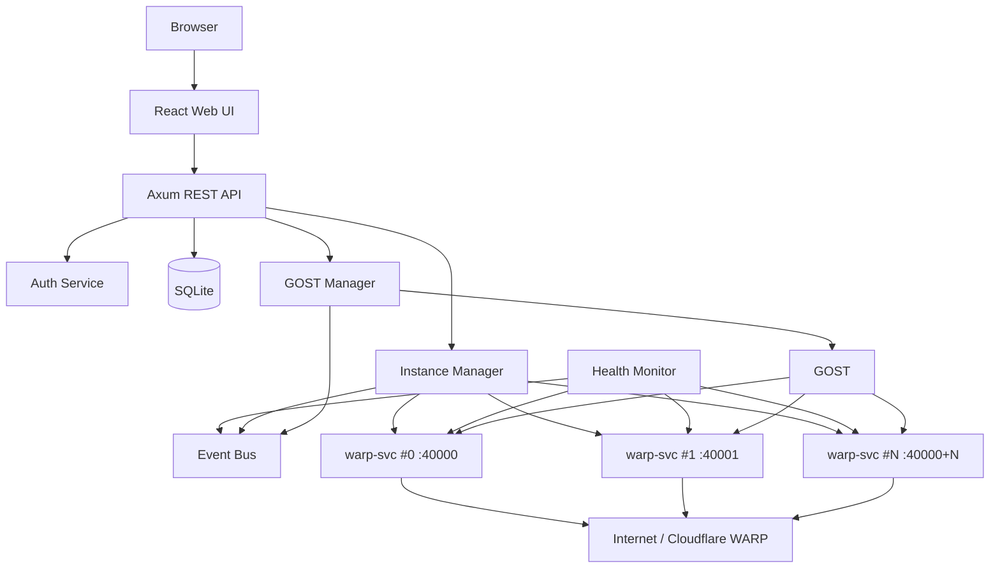
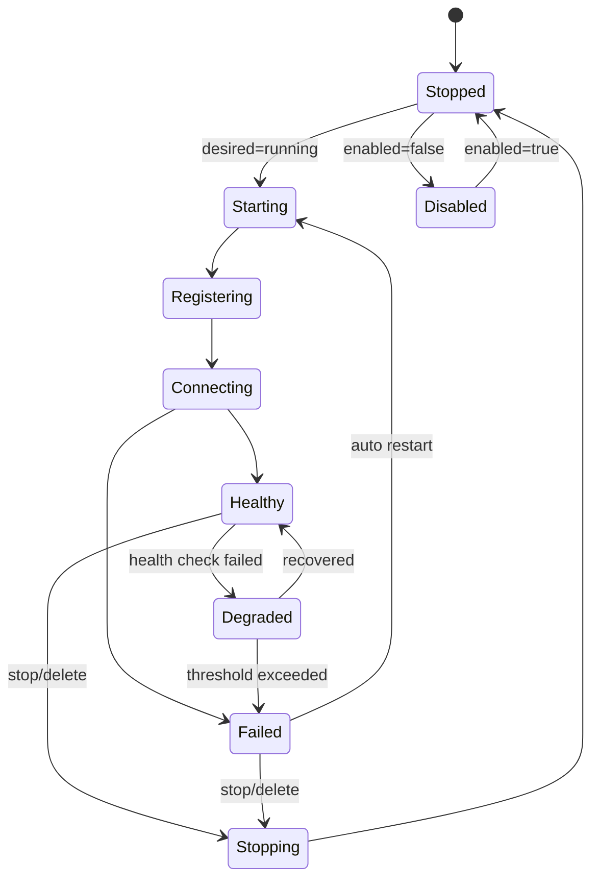
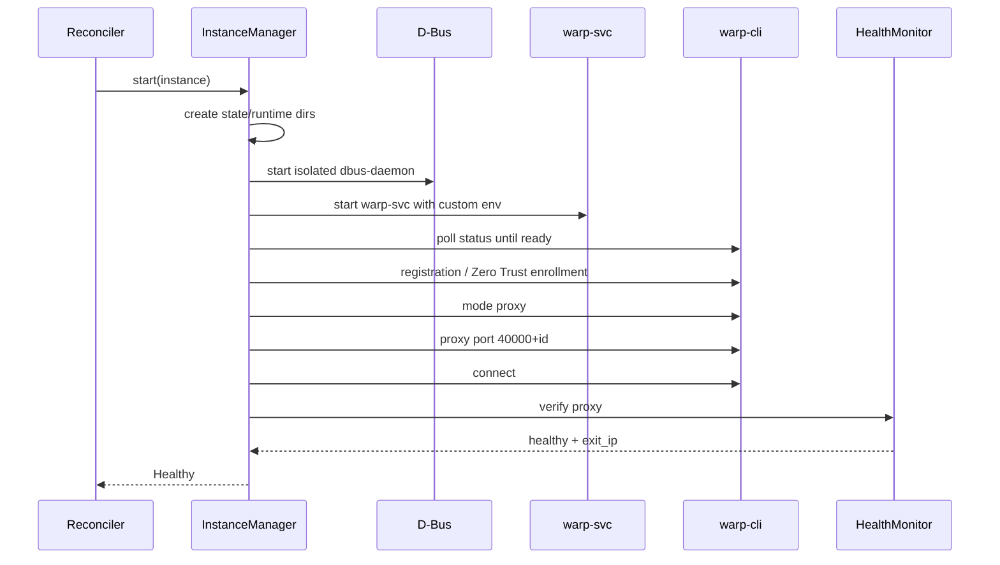

# WarpDeck: Cloudflare WARP Web Manager 设计与开发文档

> 工作名称：**WarpDeck**（可替换）  
> 目标：重新设计一个带 Web 管理页面、动态实例管理、代理管理、状态监控和安全配置的 WARP 管理系统。  
> 推荐技术栈：**Rust + Axum + Tokio + SQLite + React + TypeScript + GOST + Cloudflare WARP**  
> 交付形态：优先单 Docker 镜像，浏览器打开管理页面即可完成日常操作。  
> **MVP 协议范围锁定：仅 SOCKS5 与 HTTP；不实现 Direct Proxy、Shadowsocks 或其他代理协议。**  
> **默认端口：Web `9000`、SOCKS5 `11080`、HTTP `18080`；WARP 实例内部端口从 `40000` 递增。**

---

## 当前设计基线（2026-08）

- MVP 协议：SOCKS5 + HTTP。
- Web/API：`9000`。
- SOCKS5：`11080`。
- HTTP：`18080`。
- WARP upstream：`40000 + instance_id`，仅容器内部。
- Web UI 不修改 Docker Host publish；Host 端口由 Compose/.env 管理。
- 日常开发禁止以反复 `docker build` 作为测试循环；真实 WARP 测试复用固定 `dev-base`。
- 账号模型：v0.1 单一全局；**v0.2 演进为多账号档案（`account_profiles`）**，实例绑定档案（§16.9）。
- 默认档案 `free` 内置且不可删除；WARP+ key 单设备绑定，禁止一个 key 多档案复用。

---

## 目录

- [1. 项目背景](#1-项目背景)
- [2. 能力盘点](#2-能力盘点)
- [3. 产品目标与非目标](#3-产品目标与非目标)
- [4. 总体架构](#4-总体架构)
- [5. 核心设计原则](#5-核心设计原则)
- [6. 技术栈](#6-技术栈)
- [7. 仓库目录结构](#7-仓库目录结构)
- [8. 运行时目录与端口规划](#8-运行时目录与端口规划)
- [9. WARP 实例模型](#9-warp-实例模型)
- [10. 实例状态机](#10-实例状态机)
- [11. Instance Manager 设计](#11-instance-manager-设计)
- [12. Reconciler 设计](#12-reconciler-设计)
- [13. GOST 代理层设计](#13-gost-代理层设计)
- [14. 健康检查设计](#14-健康检查设计)
- [15. 配置与密钥管理](#15-配置与密钥管理)
- [16. SQLite 数据模型](#16-sqlite-数据模型)
- [17. REST API 设计](#17-rest-api-设计)
- [18. WebSocket / SSE 事件设计](#18-websocket--sse-事件设计)
- [19. Web 前端设计](#19-web-前端设计)
- [20. 登录与安全设计](#20-登录与安全设计)
- [21. Rust 后端工程设计](#21-rust-后端工程设计)
- [22. 前端工程设计](#22-前端工程设计)
- [23. Docker 设计](#23-docker-设计)
- [24. 从零开发步骤](#24-从零开发步骤)
- [25. 开发与测试要求](#25-开发与测试要求)
- [26. CI/CD 与发布](#26-cicd-与发布)
- [27. 日志、指标与可观测性](#27-日志指标与可观测性)
- [28. 故障处理与恢复](#28-故障处理与恢复)
- [29. 安全检查清单](#29-安全检查清单)
- [30. MVP 验收标准](#30-mvp-验收标准)
- [31. 后续版本路线](#31-后续版本路线)
- [32. 数据目录与迁移说明](#32-数据目录与迁移说明)
- [33. 许可证与发布边界](#33-许可证与发布边界)
- [34. 推荐的第一批 Issue](#34-推荐的第一批-issue)
- [35. 参考资料](#35-参考资料)

---

# 1. 项目背景

WARP 管理系统需要解决的底层问题：

1. 在 Docker 中安装和运行 Cloudflare WARP Client。
2. 使用 WARP 的 `proxy` 模式提供本地 SOCKS5 出口。
3. 使用 GOST 将内部 WARP 代理暴露为多种代理协议；本项目 MVP 只继承 SOCKS5 与 HTTP。
4. 支持多个独立 `warp-svc` 实例。
5. 多个实例可以获得不同的 Cloudflare 出口，并通过 GOST 进行轮询。
6. 支持 WARP+ License。
7. 支持 Cloudflare Zero Trust Service Token Enrollment。
8. 支持代理账号密码、IP 白名单、并发限制和请求速率限制。

但当前系统仍然属于“**容器启动时一次性配置**”模型：

```text
Docker Compose / Environment Variables
                |
                v
          entrypoint.sh
                |
       +--------+--------+
       |                 |
   warp-svc x N         GOST
       |                 |
       +--------+--------+
                |
          Proxy Ports
```

实例数量、认证参数、License、Zero Trust 等参数发生变化时，通常需要修改环境变量并重新创建容器。

本项目要把它升级成：

```text
Browser
   |
   v
Web UI
   |
   v
warp-manager API
   |
   +--> Instance Manager ---> warp-svc #0
   |                     ---> warp-svc #1
   |                     ---> warp-svc #N
   |
   +--> Health Monitor
   |
   +--> GOST Manager ---> SOCKS5 :11080 / HTTP :18080
   |
   +--> SQLite
```

核心变化是：**从静态启动脚本升级成持续运行的控制平面。**

---

# 2. 能力盘点

## 2.1 值得直接继承的行为

建议保留以下行为语义，同时明确区分“基础能力”和“本项目 MVP 范围”：

| 能力 | 基准行为 | 新项目处理方式 |
|---|---|---|
| WARP 数据持久化 | `/var/lib/cloudflare-warp` | 每实例独立目录 |
| 多实例 | `WARP_INSTANCES=N` | Web/API 动态增删 |
| 内部 WARP 端口 | 从 `40000` 开始 | `40000 + instance_id` |
| SOCKS5 WARP | 默认 `1080` | **改为固定容器端口 `11080`** |
| HTTP WARP | 默认 `8080` | **改为固定容器端口 `18080`** |
| Direct Proxy | 支持 | **MVP 不实现** |
| Shadowsocks | 支持 | **MVP 不实现** |
| WARP+ | License Key | 改为 Web Secret 配置 |
| Zero Trust | Org + Service Token | 改为 Web Secret 配置 |
| Proxy Auth | User/Password | 动态配置 |
| IP Allowlist | CIDR | 动态配置 |
| Rate Limit | GOST | 动态配置 |
| 多节点路由 | GOST Round Robin | 抽象为 Routing Policy |

MVP 数据平面固定为：

```text
SOCKS5 :11080 ---+                 +--> WARP #0 :40000
                 |                 +--> WARP #1 :40001
HTTP   :18080 ---+--> GOST Pool ---+--> WARP #2 :40002
                                   +--> ...
```

不在第一版为“未来可能支持的协议”保留可运行 listener、数据库字段或 UI 开关；未来新增协议时通过 schema migration 和独立功能迭代加入。

## 2.2 不建议原样保留的部分

### 大型 `entrypoint.sh`

它适合“启动即配置”的 Docker 工具，不适合 Web 控制平面。

应该拆成：

```text
InstanceManager
WarpCliAdapter
GostManager
HealthMonitor
ConfigService
SecretStore
EventBus
```

### 环境变量作为动态配置源

环境变量应该只保留**启动级配置**，例如：

```text
WARP_MANAGER_BIND
WARP_MANAGER_PORT
WARP_MANAGER_DATA_DIR
WARP_MANAGER_LOG_LEVEL
WARP_MANAGER_MASTER_KEY
DATABASE_URL
```

动态业务配置进入 SQLite。

### `sudo ALL=(ALL) NOPASSWD:ALL`

不建议照搬。

开发阶段可以先运行在容器 root 用户中以减少阻碍；准备发布时再做权限最小化，或者为 `warp` 用户配置严格的命令白名单。

---

# 3. 产品目标与非目标

## 3.1 MVP 产品目标

用户应该能够只通过浏览器完成：

- 首次管理员初始化。
- 登录管理后台。
- 创建 WARP 实例。
- 删除 WARP 实例。
- 启动、停止、重启某个实例。
- 查看每个实例连接状态。
- 查看每个实例出口 IP。
- 查看出口是否真的为 `warp=on`。
- 查看简单延迟。
- 开关 SOCKS5 / HTTP 代理。
- 配置代理账号密码。
- 配置 IP 白名单。
- 配置并发和 RPS 限制。
- 配置免费 WARP / WARP+ / Zero Trust。
- 查看实时日志。
- 在实例故障时自动重启。
- Docker 重启后恢复期望配置。

## 3.2 非目标

第一版不要做：

- Kubernetes Controller。
- 多服务器集中管理。
- 复杂 RBAC。
- 计费系统。
- 商业代理出售平台。
- 用户自助代理账号系统。
- 大规模节点调度。
- 任意 Shell 终端。
- 浏览器直接执行任意 `warp-cli` 参数。
- Direct SOCKS5 / Direct HTTP。
- Shadowsocks。
- Web 页面动态修改 Docker Host 端口映射。

保持 MVP 聚焦，否则很容易把一个管理面板做成复杂的代理平台。

---

# 4. 总体架构

## 4.1 逻辑架构



## 4.2 进程模型

推荐容器内长期运行的核心进程只有一个主控：

```text
tini
  `-- warp-manager
        |-- dbus-daemon instance-0
        |-- warp-svc instance-0
        |-- dbus-daemon instance-1
        |-- warp-svc instance-1
        |-- ...
        `-- gost
```

`warp-manager` 必须负责：

- Child process 生命周期。
- PID 追踪。
- stdout/stderr 收集。
- graceful shutdown。
- 异常退出检测。
- 重启策略。
- 实际状态与数据库期望状态的 reconciliation。

---

# 5. 核心设计原则

## 5.1 Desired State 与 Actual State 分离

数据库保存的是用户希望达到的状态：

```text
enabled = true
instances = 5
http_proxy.enabled = true
```

进程管理器观察的是实际状态：

```text
instance-0 process running
instance-1 process crashed
instance-2 connected
```

Reconciler 负责将两者重新收敛。

这比 API 中直接执行 shell 命令可靠很多。

## 5.2 每个 WARP 实例都必须独立

每个实例至少拥有：

```text
state dir
runtime dir
D-Bus socket
internal proxy port
process PID
health state
```

任何实例失败都不能污染其他实例。

## 5.3 Web API 不暴露任意命令执行

禁止：

```http
POST /api/run-command
{
  "command": "warp-cli ..."
}
```

只允许显式领域动作：

```http
POST /api/instances/3/restart
POST /api/instances/3/connect
```

## 5.4 Secret 永远不通过 GET 返回明文

例如：

```json
{
  "warp_license_configured": true,
  "zero_trust_client_secret_configured": true
}
```

而不是返回真正 Secret。

## 5.5 后端负责最终校验

前端只能提升体验，不能承担安全校验。

所有：

- CIDR
- Port
- Username
- Instance Count
- Proxy Limits
- Zero Trust 配置组合

必须在 Rust 后端再次验证。

---

# 6. 技术栈

## 6.1 推荐主方案

### Backend

```text
Rust
Axum
Tokio
SQLx + SQLite
Serde
Tracing
Tower / tower-http
Argon2
Cookie / Session
WebSocket or SSE
```

### Frontend

```text
React
TypeScript
Vite
React Router
TanStack Query
React Hook Form
Zod
Tailwind CSS（可选）
```

### Runtime

```text
Ubuntu 24.04
cloudflare-warp
GOST
D-Bus
SQLite
```

## 6.2 为什么选 Rust

这个项目的后端本质是一个 daemon / supervisor：

- 需要管理多个进程。
- 需要读取 stdout/stderr。
- 需要并发健康检查。
- 需要强状态模型。
- 需要优雅处理 shutdown。
- 需要长期稳定运行。

Rust + Tokio 非常适合这个场景。

如果团队只熟悉 Go，Go 也完全可行；本文后续以 Rust 为参考实现。

---
# 7. 仓库目录结构

推荐使用单仓库：

```text
warpdeck/
├── Cargo.toml
├── Cargo.lock
├── README.md
├── LICENSE
├── Dockerfile
├── docker-compose.yml
├── .env.example
├── .gitignore
│
├── crates/
│   ├── warpdeck-server/
│   │   ├── Cargo.toml
│   │   └── src/
│   │       ├── main.rs
│   │       ├── app.rs
│   │       ├── config.rs
│   │       ├── error.rs
│   │       ├── state.rs
│   │       │
│   │       ├── api/
│   │       │   ├── mod.rs
│   │       │   ├── auth.rs
│   │       │   ├── system.rs
│   │       │   ├── instances.rs
│   │       │   ├── proxy.rs
│   │       │   ├── accounts.rs
│   │       │   ├── settings.rs
│   │       │   └── events.rs
│   │       │
│   │       ├── domain/
│   │       │   ├── mod.rs
│   │       │   ├── instance.rs
│   │       │   ├── proxy.rs
│   │       │   ├── account.rs
│   │       │   ├── health.rs
│   │       │   └── events.rs
│   │       │
│   │       ├── manager/
│   │       │   ├── mod.rs
│   │       │   ├── instance_manager.rs
│   │       │   ├── reconciler.rs
│   │       │   ├── gost_manager.rs
│   │       │   ├── health_monitor.rs
│   │       │   └── log_manager.rs
│   │       │
│   │       ├── adapter/
│   │       │   ├── mod.rs
│   │       │   ├── warp_cli.rs
│   │       │   ├── process.rs
│   │       │   ├── cloudflare_trace.rs
│   │       │   └── filesystem.rs
│   │       │
│   │       ├── storage/
│   │       │   ├── mod.rs
│   │       │   ├── sqlite.rs
│   │       │   ├── instance_repo.rs
│   │       │   ├── settings_repo.rs
│   │       │   └── secret_repo.rs
│   │       │
│   │       └── security/
│   │           ├── mod.rs
│   │           ├── password.rs
│   │           ├── session.rs
│   │           ├── csrf.rs
│   │           └── secret_crypto.rs
│   │
│   └── warpdeck-core/
│       ├── Cargo.toml
│       └── src/
│           └── lib.rs
│
├── web/
│   ├── package.json
│   ├── pnpm-lock.yaml
│   ├── vite.config.ts
│   ├── tsconfig.json
│   └── src/
│       ├── main.tsx
│       ├── app.tsx
│       ├── api/
│       ├── components/
│       ├── features/
│       │   ├── auth/
│       │   ├── dashboard/
│       │   ├── instances/
│       │   ├── proxy/
│       │   ├── accounts/
│       │   ├── logs/
│       │   └── settings/
│       ├── hooks/
│       ├── routes/
│       ├── types/
│       └── styles/
│
├── migrations/
│   ├── 0001_settings.sql
│   ├── 0002_warp_instances.sql
│   ├── 0003_auth_secrets.sql
│   └── 0004_drop_audit_log.sql
│
├── runtime/
│   └── gost-template.yaml
│
├── scripts/
│   ├── dev.sh
│   ├── smoke-test.sh
│   └── release.sh
│
└── docs/
    ├── architecture.md
    ├── api.md
    ├── security.md
    └── troubleshooting.md
```

MVP 阶段如果不想一开始拆 workspace，也可以先只有一个 Rust crate；但领域、进程和 API 模块边界最好从第一天就保留。

---

# 8. 运行时目录与端口规划

## 8.1 数据目录

统一使用：

```text
/var/lib/warpdeck
```

建议结构：

```text
/var/lib/warpdeck/
├── warpdeck.db
├── master.key
├── instances/
│   ├── 0/
│   │   └── state/
│   ├── 1/
│   │   └── state/
│   └── 2/
│       └── state/
├── logs/
│   ├── manager.log
│   ├── instance-0.log
│   └── gost.log
└── generated/
    └── gost.yaml
```

运行时临时文件：

```text
/run/warpdeck/
├── instances/
│   ├── 0/
│   │   ├── warp/
│   │   └── dbus/system_bus_socket
│   └── 1/
└── pids/
```

## 8.2 端口

MVP 使用固定的**容器内 listener 端口**，避免运行时端口变更与 Docker Host publish 状态不一致。

### 对外服务

| 容器端口 | 功能 | MVP 状态 |
|---:|---|---|
| `9000` | Web UI + REST API + SSE | 开 |
| `11080` | SOCKS5 through WARP | 开 |
| `18080` | HTTP through WARP | 开 |

### 内部 WARP 实例

```text
instance 0 -> 127.0.0.1:40000
instance 1 -> 127.0.0.1:40001
instance 2 -> 127.0.0.1:40002
...
```

`40000+` 只用于容器内部 WARP upstream，**绝对不要映射到 Docker Host**。

### Host 端口自定义规则

MVP 不允许 Web UI 动态修改 Docker Host publish。用户如需更换宿主机端口，应在 Compose 层修改：

```yaml
ports:
  - "${WEB_HOST_BIND:-127.0.0.1}:${WEB_HOST_PORT:-9000}:9000"
  - "${SOCKS5_HOST_BIND:-127.0.0.1}:${SOCKS5_HOST_PORT:-11080}:11080"
  - "${HTTP_HOST_BIND:-127.0.0.1}:${HTTP_HOST_PORT:-18080}:18080"
```

例如宿主机希望使用 `7890/7891`：

```env
SOCKS5_HOST_PORT=7890
HTTP_HOST_PORT=7891
```

容器内部依旧固定监听 `11080/18080`。这种设计使应用配置、健康检查、测试用例与 Docker 网络模型保持稳定。

# 9. WARP 实例模型

建议领域模型：

```rust
pub struct WarpInstance {
    pub id: i64,
    pub name: String,
    pub enabled: bool,
    pub desired_state: DesiredState,
    pub runtime_state: RuntimeState,

    pub internal_proxy_port: u16,
    pub state_dir: PathBuf,
    pub runtime_dir: PathBuf,
    pub dbus_socket: PathBuf,

    pub pid: Option<u32>,
    pub dbus_pid: Option<u32>,

    pub exit_ip: Option<IpAddr>,
    pub colo: Option<String>,
    pub warp_status: Option<String>,
    pub latency_ms: Option<u32>,

    pub restart_count: u32,
    pub last_error: Option<String>,
    pub last_healthy_at: Option<DateTime<Utc>>,
}
```

其中数据库不需要保存全部 runtime 字段。

数据库保存：

```text
id
name
enabled
desired_state
auto_restart
created_at
updated_at
```

内存 Runtime Registry 保存：

```text
PID
RuntimeState
Exit IP
Latency
Health
Last Error
```

---

# 10. 实例状态机

建议状态：

```rust
pub enum RuntimeState {
    Disabled,
    Stopped,
    Starting,
    Registering,
    Connecting,
    Healthy,
    Degraded,
    Stopping,
    Failed,
}
```

状态转换：



`Registering` / `Connecting` 是内部阶段状态：P2-P4 实现中启动全程以 `Starting` 表示
（registry 不细分），除非后续阶段（如 API 进度展示）需要细分，否则不建议拆开。

不要把 `warp-cli status` 返回的字符串直接当领域状态。应该由 Adapter 解析后转换成稳定的内部 enum。

### 10.1 阈值 Failed 的语义（P4 实测约束）

`Degraded -> Failed` 有两条路径，语义不同：

```text
crash Failed      进程已死（watcher 置 Failed 并清空 warp_pid）
threshold Failed  进程仍在运行，只是连续探测失败（如网络抖动、warp=off）
```

阈值 Failed 的实例**不 kill 进程、健康循环也不继续探测**（探测只针对 Healthy/Degraded）——停止探测是为了避免对已知坏实例反复打日志与开销。因此：

- 阈值 Failed 的**唯一自动恢复路径是 restart**（手动或 Reconciler `auto_restart`）；
- `start` API 对仍在 `runs` 表中的实例（含阈值 Failed 但进程存活）返回 `AlreadyRunning`，属预期语义（P3-008），UI 应引导 restart 而非 start；
- 健康循环每轮仍会刷新 Degraded 实例的指标（exit_ip/colo/latency）与 `last_error`（含 `warp is off` 等失败原因），供 UI 展示。

---

# 11. Instance Manager 设计

`InstanceManager` 是全项目最核心的模块。

## 11.1 对外接口

建议定义 trait：

```rust
#[async_trait]
pub trait WarpRuntime: Send + Sync {
    async fn start(&self, spec: &InstanceSpec) -> Result<RuntimeHandle>;
    async fn stop(&self, id: InstanceId) -> Result<()>;
    async fn restart(&self, id: InstanceId) -> Result<()>;
    async fn status(&self, id: InstanceId) -> Result<InstanceRuntimeStatus>;
    async fn connect(&self, id: InstanceId) -> Result<()>;
    async fn disconnect(&self, id: InstanceId) -> Result<()>;
}
```

这样测试时可以注入 Fake Runtime，而不是 CI 真启动 Cloudflare WARP。

## 11.2 启动一个实例的完整流程



> v0.2 多账号：上图中「registration / Zero Trust enrollment」的凭据来自该实例
> 绑定的 `account_profile`（§16.9）；每个档案用独立注册状态（实例目录内各自 reg.json）。
>
> v0.2 实现注记：ZeroTrust 档案**不使用** `warp-cli teams-enroll`（交互式 OAuth
> 无法 headless）。manager 在 warp-svc 启动前把 `mdm.xml` 写入该实例
> `STATE_DIRECTORY`，内容含 `organization` + `auth_client_id` +
> `auth_client_secret`（service token），并**一并下发 `service_mode=proxy` 与
> `proxy_port=40000+id`**——Teams（managed）账号禁止 CLI 改 mode/端口，只能由
> mdm 下发；warp-svc 启动即自动以服务令牌注册并按 mdm 应用代理配置。换回非
> ZeroTrust 档案时残留 mdm.xml 会被清除（防止旧注册污染实例）。
>
> v0.2 启动竞态（E2E-08 实测修复）：mdm 注册在 warp-svc **启动后异步**完成
> （实测约 3s），且注册完成前 `warp-cli connect` 报 `MissingRegistration`。启动
> 流程对 ZeroTrust 的 connect 仅在 `MissingRegistration` 签名下，于
> `ZT_REGISTRATION_WAIT_TIMEOUT`（60s）预算内按 `ZT_CONNECT_RETRY_POLL_INTERVAL`
> （2s）有界重试；其余 connect 失败立即上浮，不消耗预算。此外 mdm.xml 必须随档
> 下发 `warp_tunnel_protocol=masque`：org 设备档案默认 Wireguard，而 WarpProxy
> 模式只支持 MASQUE，缺此项时连接报 `InvalidKey("Proxy mode only supports MASQUE")`。
>
> v0.2 后补充实测结论（2026-08-20，客户端 2026.6.880.0）：
> - **mdm 值必须用 serde 小写名 `masque`**：warp-svc 的 plist 解析按小写枚举名匹配，
>   写 CLI 显示名 `MASQUE` 会被**静默解析回默认 Wireguard**（LocalPolicy 日志可见
>   `Some(Wireguard)`），随后连接报 `InvalidKey("Proxy mode only supports MASQUE")`
>   ——失败形态与「缺键」相同，极易误诊。代码中该值硬编码于 mdm.rs，禁止改用
>   `warp-cli tunnel protocol set` 的官方大小写值。
> - **WarpProxy 模式对所有账号类型只支持 MASQUE**（free/warp_plus 同样受限；
>   Cloudflare 自客户端 2025.7.106.1 起在 proxy 模式弃用 WireGuard）。free 实例
>   经 `warp-cli mode proxy` 同样跑在 proxy 模式，因此「实例级隧道协议自选」在本
>   架构下不可实现——已评估并否决（wireguard 选项必然导致实例 Failed）。
>   WireGuard 仅在完整隧道模式（tun）可用，与本项目端口代理形态不兼容。

## 11.3 每实例环境

每个实例注入独立的环境变量以隔离 state / runtime / D-Bus：

```text
STATE_DIRECTORY=/var/lib/warpdeck/instances/{id}/state
RUNTIME_DIRECTORY=/run/warpdeck/instances/{id}/warp
DBUS_SYSTEM_BUS_ADDRESS=unix:path=/run/warpdeck/instances/{id}/dbus/system_bus_socket
```

启动 `warp-svc` 时将这些环境变量注入。

运行 `warp-cli` 时必须注入相同的：

```text
RUNTIME_DIRECTORY
DBUS_SYSTEM_BUS_ADDRESS
```

否则 `warp-cli` 可能连接错误实例。

## 11.4 内部端口计算

不要在多处散落：

```rust
const FIRST_WARP_PORT: u16 = 40000;

fn instance_proxy_port(id: u16) -> Result<u16> {
    FIRST_WARP_PORT
        .checked_add(id)
        .ok_or(Error::PortOverflow)
}
```

并且限制实例 ID 上限。

## 11.5 注册策略

普通 WARP：

```text
无 reg.json
   |
   v
warp-cli registration new
   |
   +-- success --> optional license
   |
   `-- fail --> backoff retry
```

已有注册数据：

```text
reg.json exists
   |
   +--> 不重复 registration new
   |
   `--> 如果 License 配置变化，重新 apply license
```

## 11.6 Backoff

建议：

```text
base: 2s
factor: 2
max: 120s
jitter: 0~30%
max_attempts: configurable
```

不要所有实例同一秒重试，否则故障时会产生惊群。

## 11.7 Graceful Stop

顺序：

1. 标记状态 `Stopping`。
2. 停止将该实例放入新 GOST 路由。
3. 给 `warp-svc` 发送终止信号。
4. 等待 grace period。
5. 超时后强杀。
6. 停止对应 D-Bus。
7. 清理 `/run` 临时目录。
8. 保留 `/var/lib` 注册数据。
9. 状态转 `Stopped`。

删除实例时才决定是否删除持久化数据。

API 应支持：

```json
{
  "delete_data": false
}
```

默认不要删除注册数据。

---

# 12. Reconciler 设计

不要让 HTTP Handler 直接成为 supervisor。

HTTP Handler 只更新 desired state：

```text
POST /instances/3/start
        |
        v
DB desired_state = running
        |
        v
notify reconciler
```

Reconciler：

```rust
loop {
    let desired = repo.list_instances().await?;
    let actual = registry.snapshot().await;

    reconcile_instances(desired, actual).await;

    tokio::select! {
        _ = interval.tick() => {},
        _ = reconcile_notify.notified() => {},
        _ = shutdown.recv() => break,
    }
}
```

好处：

- API 超时不会破坏状态。
- Manager 重启后能够恢复。
- Docker 重启后自动恢复期望运行实例。
- API 和进程生命周期解耦。

## 12.1 Reconcile 规则

### desired=running, actual=stopped

```text
start
```

### desired=stopped, actual=running

```text
stop
```

### desired=running, actual=failed, auto_restart=true

```text
backoff -> restart
```

### enabled=false

无论 desired state，最终都应该停止。

---

# 13. GOST 代理层设计

## 13.1 单一代理网关

每个 WARP 实例都只暴露容器内部 SOCKS5 upstream，由 GOST 统一对客户端提供两个 listener：

```text
Client SOCKS5 ---> :11080 ---+
                             |
Client HTTP   ---> :18080 ---+--> GOST healthy pool
                                      |
                                      +--> 127.0.0.1:40000
                                      +--> 127.0.0.1:40001
                                      +--> 127.0.0.1:40002
```

只有 `Healthy` 实例进入节点池。

MVP **不创建** Direct Proxy 或 Shadowsocks listener。

## 13.2 Routing Policy

MVP 只需要真正实现：

```text
round_robin
```

领域层可以预留：

```rust
pub enum RoutingStrategy {
    RoundRobin,
    Random,
    Failover,
}
```

未实现的策略不能出现在可配置 UI 中。

## 13.3 GOST Manager 职责

```text
render_config()
validate_config()
start()
stop()
restart()
status()
probe_listeners()
```

配置输入包括：

- Healthy WARP upstream 列表。
- SOCKS5 / HTTP enable 状态。
- Proxy authentication。
- CIDR allowlist。
- 并发限制。
- RPS 限制。
- Routing strategy。

端口 `11080/18080` 在 MVP 中属于应用常量，不进入动态数据库配置。

## 13.4 配置更新策略

MVP 最稳妥的策略：

1. 根据健康节点生成新配置到临时文件。
2. 做语法和结构校验。
3. 原子 rename 成正式配置。
4. 重启 GOST。
5. 检查 `11080` 与 `18080` listener 是否恢复。
6. 通过测试请求验证至少一个数据面路径。

不要一开始依赖未经当前 GOST 版本验证的热重载行为。

## 13.5 空节点池

如果一个 Healthy 实例都没有：

- GOST listener 可以继续存在；
- 请求明确失败；
- UI 标记代理服务为 `Degraded`；
- 不应将 listener 消失和 upstream 不健康混为一谈。

```text
Proxy: Running
Healthy upstreams: 0
Service state: Degraded
```

# 14. 健康检查设计

健康检查分 3 层。

## 14.1 Level 1：进程健康

检查：

```text
warp-svc PID 是否存在
child.try_wait() 是否退出
```

## 14.2 Level 2：WARP 控制面健康

通过对应实例环境执行：

```text
warp-cli --accept-tos status
```

解析成：

```rust
struct WarpCliStatus {
    connected: bool,
    raw_status: String,
}
```

## 14.3 Level 3：真实数据面健康

必须通过实例的 SOCKS5 内部端口发请求：

```text
curl --socks5-hostname 127.0.0.1:40000 \
  https://cloudflare.com/cdn-cgi/trace
```

解析：

```text
ip=
colo=
warp=
```

只有 `warp=on` 或符合预期 WARP 状态时才认为数据面健康。

## 14.4 健康评分

建议：

```text
process_alive      +1
warp_cli_connected +1
proxy_request_ok   +2
warp_verified      +2
```

但领域层最终仍映射成简单状态：

```text
Healthy
Degraded
Failed
```

## 14.5 失败阈值

避免网络偶发抖动立即重启：

```text
consecutive_failures < 3 -> Degraded
consecutive_failures >= 3 -> Failed
```

恢复也可要求连续 2 次成功再进入 Healthy。

失败输入包括：控制面断开（`warp-cli status` 失败）、数据面探测失败、探测成功但 `warp != on`（离线但不掉线，记 `last_error = "warp is off"`）。

阈值 Failed 的进程保留运行，恢复路径见 §10.1（Reconciler `auto_restart`）。

---

# 15. 配置与密钥管理

## 15.1 配置分类

### Bootstrap Config

来自环境变量：

```text
WARPDECK_BIND=0.0.0.0
WARPDECK_PORT=9000
WARPDECK_DATA_DIR=/var/lib/warpdeck
WARPDECK_LOG=info
DATABASE_URL=sqlite:/var/lib/warpdeck/warpdeck.db
WARPDECK_MASTER_KEY=optional
```

### Dynamic Config

SQLite：

```text
Proxy Settings
Instance Desired State
Health Settings
Routing Strategy
Account Mode
```

### Secrets

加密后存 SQLite：

```text
WARP License Key
Zero Trust Client ID
Zero Trust Client Secret
Proxy Password
```

## 15.2 Master Key

推荐优先级：

1. `WARPDECK_MASTER_KEY` 环境变量。
2. `/var/lib/warpdeck/master.key`。
3. 首次启动生成随机 key。

文件权限：

```text
0600
```

## 15.3 Secret Encryption

推荐 AEAD：

```text
XChaCha20-Poly1305
```

数据库：

```text
ciphertext
nonce
key_version
```

API 永远不返回解密后的 secret。

---

# 16. SQLite 数据模型

## 16.1 `users`

```sql
CREATE TABLE users (
    id              INTEGER PRIMARY KEY,
    username        TEXT NOT NULL UNIQUE,
    password_hash   TEXT NOT NULL,
    created_at      TEXT NOT NULL,
    updated_at      TEXT NOT NULL
);
```

MVP 只需要一个管理员账号，但表结构不要写死单用户。

## 16.2 `sessions`

如果选择数据库 session：

```sql
CREATE TABLE sessions (
    id              TEXT PRIMARY KEY,
    user_id         INTEGER NOT NULL,
    expires_at      TEXT NOT NULL,
    created_at      TEXT NOT NULL,
    last_seen_at    TEXT NOT NULL,
    FOREIGN KEY(user_id) REFERENCES users(id) ON DELETE CASCADE
);
```

## 16.3 `warp_instances`

```sql
CREATE TABLE warp_instances (
    id              INTEGER PRIMARY KEY,
    name            TEXT NOT NULL,
    enabled         INTEGER NOT NULL DEFAULT 1,
    desired_state   TEXT NOT NULL DEFAULT 'running',
    auto_restart    INTEGER NOT NULL DEFAULT 1,
    -- v0.2 多账号：绑定的账号档案；NULL = 默认 free 账号（见 §16.9）。
    account_profile_id INTEGER REFERENCES account_profiles(id),
    created_at      TEXT NOT NULL,
    updated_at      TEXT NOT NULL
);
```

不要保存 PID。PID 是 runtime state，不是持久状态。

## 16.4 `proxy_config`

MVP 容器内端口固定为 SOCKS5 `11080`、HTTP `18080`，因此不把端口保存到数据库，避免产生“数据库已改端口但 Docker Host 没有 publish”的伪配置状态。

```sql
CREATE TABLE proxy_config (
    id                       INTEGER PRIMARY KEY CHECK (id = 1),

    socks5_enabled           INTEGER NOT NULL DEFAULT 1,
    http_enabled             INTEGER NOT NULL DEFAULT 1,

    auth_enabled             INTEGER NOT NULL DEFAULT 0,
    proxy_username           TEXT,
    proxy_password_secret_id INTEGER,

    allowed_ips              TEXT,
    max_connections          INTEGER NOT NULL DEFAULT 10,
    max_rps                  INTEGER NOT NULL DEFAULT 10,
    routing_strategy         TEXT NOT NULL DEFAULT 'round_robin',

    updated_at               TEXT NOT NULL
);
```

API 可以把实际 listener 端口作为只读字段返回：

```json
{
  "socks5": {"enabled": true, "listen_port": 11080},
  "http": {"enabled": true, "listen_port": 18080}
}
```

## 16.5 `account_config`（v0.1 单一全局）

> v0.2 起该表为兼容层，语义迁移为默认 `free` 档案的视图（§16.9）；新开发按
> `account_profiles` 走，app 写入默认档时同时写这里以兼容旧进程/迁移。

```sql
CREATE TABLE account_config (
    id                  INTEGER PRIMARY KEY CHECK (id = 1),
    mode                TEXT NOT NULL DEFAULT 'free',
    license_secret_id   INTEGER,
    zero_trust_org      TEXT,
    zt_client_id_secret_id INTEGER,
    zt_client_secret_secret_id INTEGER,
    updated_at          TEXT NOT NULL
);
```

`mode`：

```text
free
warp_plus
zero_trust
```

后端验证：

```text
warp_plus   -> license required
zero_trust  -> org + client id + client secret required
```

WARP+ 与 Zero Trust 不允许同时激活。

## 16.6 `secrets`

```sql
CREATE TABLE secrets (
    id          INTEGER PRIMARY KEY,
    kind        TEXT NOT NULL,
    -- v0.2 多账号：NULL = 系统级/全局（代理密码、通用凭据）或旧数据；
    -- 非 NULL = 属于某个 account_profile（§16.9）的凭据。
    profile_id  INTEGER REFERENCES account_profiles(id) ON DELETE CASCADE,
    ciphertext  BLOB NOT NULL,
    nonce       BLOB NOT NULL,
    key_version INTEGER NOT NULL DEFAULT 1,
    created_at  TEXT NOT NULL,
    updated_at  TEXT NOT NULL
);
```

## 16.7 `settings`

```sql
CREATE TABLE settings (
    key         TEXT PRIMARY KEY,
    value       TEXT NOT NULL,
    updated_at  TEXT NOT NULL
);
```

例如：

```text
health.interval_seconds
health.failure_threshold
health.success_threshold
runtime.connect_timeout_seconds
runtime.max_restart_backoff_seconds
```

## 16.8 `audit_log`（已移除）

> **v0.1 发布后已删除**：migration `0004_drop_audit_log.sql`（commit "P12 后清理"）。
> 原设计（不再实施）：
CREATE TABLE audit_log (
    id          INTEGER PRIMARY KEY,
    user_id     INTEGER,
    action      TEXT NOT NULL,
    target      TEXT,
    detail_json TEXT,
    created_at  TEXT NOT NULL
);
```

## 16.9 `account_profiles`（v0.2 多账号）

v0.1 的单一全局账号（`account_config` 单行 + 全局凭据）在 v0.2 演进为**账号档案**：
每个档案是一组独立凭据 + 独立 WARP 出口，实例创建时选择绑定，不选则使用免费档
（全局默认）。动机：免费 WARP 出口链路易波动，多档案可为实例提供不同线路/出口。

```sql
CREATE TABLE account_profiles (
    id          INTEGER PRIMARY KEY,
    name        TEXT NOT NULL UNIQUE,            -- 用户可见名称，如 "team-a"、"warp+ 主力"
    mode        TEXT NOT NULL DEFAULT 'free'
                CHECK (mode IN ('free', 'warp_plus', 'zero_trust')),
    -- warp_plus: license_secret_id 指向 secrets(kind=license, profile_id=本行)
    -- zero_trust: org + secrets(kind=zt_client_id / zt_client_secret, profile_id=本行)
    zero_trust_org TEXT,
    created_at  TEXT NOT NULL,
    updated_at  TEXT NOT NULL
);
```

约束与语义：

```text
free         -> 无凭据要求；warp-cli 按「注册新设备」处理（与 v0.1 默认行为一致）
warp_plus    -> license 必填（secrets, kind=license, profile_id=<id>）
zero_trust   -> org + client id + client secret 三者必填（kind 同上，profile_id=<id>）
```

关键规则：

- **free 档全局唯一且只读**：全系统至多一个 `free` 模式的档案，且**永久只读**——名称/
  模式/凭据均不可改（409）、不可删除。内置默认档案即 free；此约束在"创建重复 free"
  与"对 free 档的任何 PATCH"两处强制。UI 创建表单在已有 free 档时隐藏 free 选项，
  free 档的编辑/删除按钮禁用。
- **被引用的档案只读**：被任一实例绑定（`account_profile_id = id`）的档案不可修改
  （409）；先解绑其实例（rebind 到 NULL/其他档）才能编辑。
- **WARP+ 单实例**：一个 `warp_plus` 档案（一份 license）同一时刻只能被一个实例
  绑定（创建实例/改绑时校验 → 409；已绑实例重绑自身幂等 200；解绑后才可转绑）。
  这落实「key 单设备绑定」——同一 key 多实例会互相踢下线，UI 留空/改绑都需提示。
- 全系统始终恰有一个**默认档案**（内置 id=1，不可删除、可改名），新实例未绑定即用它；
  `account_config`（v0.1 单行）语义迁移为默认档案的视图。
- **档案 name 全局唯一**（表 UNIQUE 约束，违反 → 409）。
- secret 仍只存在于 `secrets` 表密文；API 永不回显明文（GET 只给 mask/configured）。
- 删除档案：被任一生启用的实例引用时拒绝（409）；否则级联删除其 secrets 并降级。
- 档案凭据更新：仅影响绑定它的实例，且需要重启这些实例（复用 11.2 生命周期，
  应用失败必须上浮，不得静默成功）。

---

# 17. REST API 设计

统一前缀：

```text
/api/v1
```

统一 JSON。

## 17.1 错误格式

```json
{
  "error": {
    "code": "INSTANCE_NOT_FOUND",
    "message": "WARP instance 12 does not exist",
    "request_id": "req_01..."
  }
}
```

常见 HTTP 状态：

```text
400 validation
401 unauthenticated
403 forbidden / csrf
404 not found
409 state conflict
422 semantic validation
500 internal
503 runtime unavailable
```

## 17.2 Setup / Auth

### 首次初始化状态

```http
GET /api/v1/setup/status
```

```json
{
  "initialized": false
}
```

### 创建首个管理员

```http
POST /api/v1/setup
```

```json
{
  "username": "admin",
  "password": "strong-password"
}
```

只能在用户表为空时成功。

### 登录

```http
POST /api/v1/auth/login
```

### 登出

```http
POST /api/v1/auth/logout
```

### 当前用户

```http
GET /api/v1/auth/me
```

## 17.3 System

```http
GET /api/v1/system/status
```

响应：

```json
{
  "version": "0.1.0",
  "uptime_seconds": 5421,
  "instances": {
    "total": 5,
    "healthy": 4,
    "degraded": 1,
    "failed": 0
  },
  "proxy": {
    "running": true,
    "healthy_upstreams": 4
  }
}
```

## 17.4 Instances

```http
GET    /api/v1/instances
POST   /api/v1/instances
GET    /api/v1/instances/:id
PATCH  /api/v1/instances/:id
DELETE /api/v1/instances/:id
```

创建：

```json
{
  "name": "warp-5",
  "enabled": true,
  "auto_restart": true,
  "account_profile_id": 2
}
```

`account_profile_id` 可选：缺省/NULL = 默认 free 档案。创建后可经 PATCH 改绑档案；
改绑在实例下次重启时生效，后端应提示将触发 restart：

```json
{
  "account_profile_id": null
}
```

改绑约束（§16.9）：目标为 `warp_plus` 档且已被其他实例绑定时返回 409
（一个 license = 一个实例；已绑实例重绑自身幂等 200）。

动作：

```http
POST /api/v1/instances/:id/start
POST /api/v1/instances/:id/stop
POST /api/v1/instances/:id/restart
POST /api/v1/instances/:id/connect
POST /api/v1/instances/:id/disconnect
POST /api/v1/instances/:id/recheck
```

实例响应：

```json
{
  "id": 2,
  "name": "warp-2",
  "enabled": true,
  "desired_state": "running",
  "runtime_state": "healthy",
  "internal_proxy_port": 40002,
  "exit_ip": "104.x.x.x",
  "colo": "SJC",
  "warp": "on",
  "latency_ms": 48,
  "restart_count": 1,
  "last_healthy_at": "2026-08-16T14:30:00Z",
  "last_error": null,
  "account": {
    "profile_id": 2,
    "name": "team-a",
    "mode": "zero_trust"
  }
}
```

删除：

```http
DELETE /api/v1/instances/:id?delete_data=false
```

## 17.5 Proxy

```http
GET /api/v1/proxy
PUT /api/v1/proxy
```

读取示例：

```json
{
  "socks5": {
    "enabled": true,
    "listen_port": 11080
  },
  "http": {
    "enabled": true,
    "listen_port": 18080
  },
  "auth": {
    "enabled": true,
    "username": "proxyuser",
    "password_configured": true
  },
  "allowed_ips": ["192.168.1.0/24"],
  "max_connections": 50,
  "max_rps": 100,
  "routing_strategy": "round_robin"
}
```

`listen_port` 在 MVP 中是只读值；`PUT /api/v1/proxy` 如果提交端口字段应返回 `422` 或忽略未知字段（项目必须固定一种行为并测试）。宿主机端口变更由 Compose 完成。

设置代理密码使用独立 endpoint：

```http
PUT /api/v1/proxy/password
```

```json
{
  "password": "new-secret"
}
```

响应永远不返回密码明文。

## 17.6 Account

```http
## 17.6 Accounts（账号档案）

v0.1 的单一账号升级为**档案集**（§16.9）。`GET /api/v1/account` 为兼容视图，
返回默认档案；新语义下推荐：

```http
GET    /api/v1/accounts
POST   /api/v1/accounts
GET    /api/v1/accounts/:id
PATCH  /api/v1/accounts/:id
DELETE /api/v1/accounts/:id
```

读取：

```json
{
  "id": 2,
  "name": "team-a",
  "mode": "zero_trust",
  "zero_trust_org": "team-name",
  "license_configured": false,
  "client_id_configured": true,
  "client_secret_configured": true,
  "instance_count": 3,
  "default": false
}
```

写入：

```json
{
  "name": "team-a",
  "mode": "warp_plus",
  "license": "xxxxxxxx-xxxx-xxxx-xxxx-xxxxxxxxxxxx"
}
```

或 Zero Trust：

```json
{
  "name": "team-a",
  "mode": "zero_trust",
  "zero_trust_org": "team-name",
  "client_id": "xxxx",
  "client_secret": "xxxx"
}
```

约束：

- `license`/`client_secret` 提交后进 `secrets` 密文，永不回显明文。
- 不可删除：默认 `free` 档案；或 `instance_count > 0` 且任一实例 enabled（返回 409）。
- free 模式（§16.9）：创建/改回 free 在已存在 free 档时 409；对 free 档的任何 PATCH 409
  （free 只读）。
- name 重复（表约束）返回 409。
- license 与 `mode` 切换校验：mode=warp_plus 必须有 license；mode=zero_trust 必须有全套三要素。
- 凭据/模式变更会让绑定实例 mark dirty，Reconciler 按序重启；失败上浮，不得静默成功。

## 17.7 Settings

```http
GET /api/v1/settings
PUT /api/v1/settings
```

## 17.8 Logs

历史：

```http
GET /api/v1/logs?source=instance-2&limit=200
```

实时建议走 WebSocket/SSE，不要用 HTTP polling 高频刷。

---

# 18. WebSocket / SSE 事件设计

如果只需要服务器 -> 浏览器单向事件，**SSE 更简单**。

推荐：

```http
GET /api/v1/events
Accept: text/event-stream
```

事件：

```text
instance.state_changed
instance.health_changed
instance.exit_ip_changed
instance.log
instance.profile_changed
account.profile_created
account.profile_updated
account.profile_deleted
proxy.restarted
proxy.config_changed
system.warning
```

示例：

```text
event: instance.state_changed
data: {"id":2,"from":"connecting","to":"healthy"}
```

日志可以单独：

```http
GET /api/v1/logs/stream?source=instance-2
```

避免所有日志和状态事件挤在一个通道。

---
# 19. Web 前端设计

## 19.1 信息架构

```text
/login
/setup

/
├── dashboard
├── instances
│   └── /instances/:id
├── proxy
├── accounts
├── logs
└── settings
```

## 19.2 Dashboard

建议首页卡片：

```text
+----------------+ +----------------+ +----------------+
| Instances      | | Healthy        | | Proxy          |
|       5        | |      4         | | Running        |
+----------------+ +----------------+ +----------------+

+------------------------------------------------------+
| WARP Instances                                       |
| #0  Healthy   104.x.x.1   SJC    38ms               |
| #1  Healthy   104.x.x.2   LAX    51ms               |
| #2  Degraded  104.x.x.3   NRT   210ms               |
+------------------------------------------------------+

+------------------------------------------------------+
| Public Proxy                                         |
| SOCKS5        :11080    ON                            |
| HTTP          :18080    ON                            |
| Healthy upstreams: 4                                 |
+------------------------------------------------------+
```

Dashboard 只展示决策需要的数据，不要塞入所有设置。

## 19.3 Instances 页面

表格字段：

| 字段 | 说明 |
|---|---|
| Name | 实例名 |
| State | Healthy / Degraded / Failed |
| Desired | Running / Stopped |
| Internal Port | 40000+N |
| Exit IP | 当前出口 |
| Colo | Cloudflare Colo |
| Latency | 最近探测 |
| Restart | 重启次数 |
| Actions | Start/Stop/Restart/Delete |

### Add Instance

点击：

```text
+ Add Instance
```

弹窗：

```text
Name             [warp-5          ]
Auto Start       [x]
Auto Restart     [x]

             Cancel    Create
```

创建成功后 UI 不需要等待真正 Connected 才关闭弹窗；由 SSE 实时更新：

```text
Starting -> Registering -> Connecting -> Healthy
```

## 19.4 Instance Detail

建议包含：

```text
Status
Exit IP
Colo
Latency
Internal Port
PID
Started At
Last Healthy
Restart Count
Last Error
```

操作：

```text
Start
Stop
Restart
Recheck
```

下方实时日志：

```text
[14:22:10] warp-svc started
[14:22:11] registration exists
[14:22:12] setting proxy port 40002
[14:22:13] connected
[14:22:14] warp verified: on
```

## 19.5 Proxy 页面

MVP 只展示两个代理协议，不展示 Direct Proxy 或 Shadowsocks。

### Proxy Listeners

```text
SOCKS5     [ON]   Container Port 11080
HTTP       [ON]   Container Port 18080
```

端口作为只读信息展示，并提示：

> 如需修改宿主机暴露端口，请修改 Docker Compose 的 Host Port 映射；容器内部 listener 保持固定。

### Authentication

```text
Authentication [ON]
Username       [proxyuser]
Password       [********] [Change]
```

### Access Control

```text
Allowed Networks
192.168.1.0/24
10.0.0.10/32

Max Connections [50]
Max RPS         [100]
```

保存流程：

```text
validate -> persist desired config -> render GOST -> apply -> probe -> report result
```

如果 GOST apply 失败，UI 必须明确提示“配置保存/应用失败”的实际状态，不能显示虚假的成功。

## 19.6 Accounts 页面

v0.2 起为**档案管理**页（替代 v0.1 单一 Account 页）。绘制档案列表：

```text
Profile                         Mode          Instances   Default
──────────────────────────────────────────────────────────────
free（默认）                     Free          2           ✓
warp+ 主力                      WARP+         1
team-a                          Zero Trust    3
[+ Add Profile]
```

点击档案展开编辑表单。

Free：

```text
Profile Name  [free]
Mode          (o) Free WARP
              ( ) WARP+              —— 选择后切换表单
              ( ) Cloudflare Zero Trust
```

WARP+：

```text
License Key [************************] [Replace]
```

Zero Trust：

```text
Organization    [team-name]
Client ID       [****************]
Client Secret   [****************]
```

- Secret 永不回显明文；只回显 `_configured` 布尔。
- **WARP+ key 单设备绑定警示**：UI 在 WARP+ 档案上常驻提示
  「同一 License 只能同时用于一个实例，请为每个档案准备独立的 key」。
- 创建实例时可选择绑定哪个档案（§17.4 `account_profile_id`）。
- 保存后对实例的影响应明确提示：

```text
Changing account credentials requires instances using this profile to restart.
```

不要“悄悄”重建所有实例。由后端创建明确的 apply operation（mark dirty → Reconciler
按序重启），UI 展示进度（§18 SSE）。删除档案被实例引用时必须给出 409 并解释。

## 19.7 Logs 页面

支持：

```text
Source:
[All]
[Manager]
[GOST]
[Instance 0]
[Instance 1]

Level:
[All] [Info] [Warn] [Error]

[x] Follow
```

不要在浏览器保留无限日志；限制虚拟列表和内存行数。

---

# 20. 登录与安全设计

## 20.1 首次启动

首次访问：

```text
GET /setup/status -> initialized=false
```

跳转：

```text
/setup
```

创建管理员后 `/setup` 永久关闭。

必须通过数据库事务或唯一约束避免两个并发请求创建两个“首个管理员”。

## 20.2 Password Hash

使用：

```text
Argon2id
```

禁止：

```text
MD5
SHA1
SHA256(password)
```

单纯 Hash 不够，必须用 password hashing algorithm。

## 20.3 Session

推荐服务端 Session + HttpOnly Cookie：

```text
HttpOnly
SameSite=Lax or Strict
Secure=true when HTTPS
```

比把长期 JWT 放 localStorage 更适合管理后台。

## 20.4 CSRF

所有 mutation：

```text
POST
PUT
PATCH
DELETE
```

启用 CSRF 防护。

可以使用：

```text
SameSite Cookie + CSRF token
```

## 20.5 Web 默认暴露范围

推荐 `docker-compose.yml` 默认：

```yaml
ports:
  - "127.0.0.1:9000:9000"
```

也就是说管理页面默认只允许 Host 本机访问。

用户如果需要远程访问：

- 显式改成 `9000:9000`；或
- 更推荐挂 Caddy / Nginx / Traefik TLS 反代。

代理端口是否暴露公网由用户明确决定。

## 20.6 Proxy Password

只允许：

```text
set new password
rotate password
remove password
```

禁止：

```text
GET current plaintext password
```

## 20.7 Command Injection

所有进程必须通过参数数组启动，例如：

```rust
Command::new("warp-cli")
    .arg("--accept-tos")
    .arg("status");
```

禁止：

```rust
Command::new("sh")
    .arg("-c")
    .arg(format!("warp-cli {}", user_input));
```

这是整个项目最重要的安全边界之一。

---

# 21. Rust 后端工程设计

## 21.1 AppState

```rust
#[derive(Clone)]
pub struct AppState {
    pub db: SqlitePool,
    pub instances: Arc<InstanceManager>,
    pub gost: Arc<GostManager>,
    pub events: EventBus,
    pub config: Arc<AppConfig>,
}
```

不要把所有东西塞进一个巨大 `Mutex<AppStateInner>`。

每个 manager 自己管理并发边界。

## 21.2 Runtime Registry

```rust
pub struct RuntimeRegistry {
    inner: RwLock<HashMap<InstanceId, InstanceRuntime>>,
}
```

`InstanceRuntime`：

```rust
pub struct InstanceRuntime {
    pub state: RuntimeState,
    pub warp_pid: Option<u32>,
    pub dbus_pid: Option<u32>,
    pub exit_ip: Option<IpAddr>,
    pub colo: Option<String>,
    pub latency_ms: Option<u32>,
    pub restart_count: u32,
    pub consecutive_failures: u32,
    pub last_error: Option<String>,
}
```

## 21.3 WarpCliAdapter

所有 `warp-cli` 操作集中：

```rust
pub struct WarpCliAdapter;

impl WarpCliAdapter {
    pub async fn status(&self, ctx: &InstanceContext) -> Result<WarpStatus>;
    pub async fn register(&self, ctx: &InstanceContext) -> Result<()>;
    pub async fn apply_license(&self, ctx: &InstanceContext, key: &SecretString) -> Result<()>;
    pub async fn mode_proxy(&self, ctx: &InstanceContext) -> Result<()>;
    pub async fn set_proxy_port(&self, ctx: &InstanceContext, port: u16) -> Result<()>;
    pub async fn connect(&self, ctx: &InstanceContext) -> Result<()>;
    pub async fn disconnect(&self, ctx: &InstanceContext) -> Result<()>;
}
```

所有 command timeout 必须有限制。

不要允许永不结束的 `warp-cli` 把 reconciler 卡死。

## 21.4 Process Wrapper

建议统一封装：

```rust
pub struct ManagedChild {
    pub child: tokio::process::Child,
    pub started_at: Instant,
}
```

功能：

```text
spawn
wait
terminate
kill_after_timeout
pipe_stdout
pipe_stderr
```

## 21.5 Error

领域错误不要直接暴露 `anyhow` 字符串。

```rust
pub enum AppError {
    Validation(ValidationError),
    NotFound,
    Conflict(String),
    WarpCli(WarpCliError),
    Process(ProcessError),
    Database(sqlx::Error),
    Unauthorized,
    Forbidden,
    Internal(anyhow::Error),
}
```

API 层统一转换。

## 21.6 Request ID

每个 HTTP 请求产生：

```text
request_id
```

日志和错误响应都带它，排障会非常省事。

## 21.7 Shutdown

捕获：

```text
SIGTERM
SIGINT
```

顺序：

```text
stop accepting mutations
stop reconciler
stop health workers
stop GOST
stop all warp instances
flush logs/db
exit
```

如果 Docker stop 时不做 graceful shutdown，很容易留下脏 runtime 文件。

---

# 22. 前端工程设计

## 22.1 API Client

统一封装：

```text
web/src/api/client.ts
```

不要组件里到处写裸 `fetch`。

## 22.2 Server State

使用 TanStack Query 管：

```text
instances
proxy config
account config
settings
system status
```

SSE event 到达时：

```text
queryClient.setQueryData()
```

或：

```text
invalidateQueries()
```

## 22.3 Form Validation

前端 Zod schema 与后端校验规则保持一致，但**后端仍然是最终权威**。

例如端口：

```text
1..65535
```

并且必须验证端口冲突。

## 22.4 状态颜色

保持简单：

```text
Healthy     green
Starting    blue
Degraded    amber
Failed      red
Stopped     gray
```

不要只依赖颜色；同时显示文字和 icon，兼顾无障碍。

## 22.5 Dangerous Actions

以下操作需要二次确认：

```text
Delete instance data
Reset all instances
Remove credentials
Factory reset
```

普通 Restart 不需要过度确认。

---

# 23. Docker 设计

## 23.1 Docker 的角色

Docker 是**运行时封装与发布产物**，不是默认的代码编译循环。

开发规则：

```text
Rust / Web / API / DB 普通改动 -> 不重新 build Docker 镜像
Dockerfile / OS 依赖 / WARP / GOST 安装逻辑改动 -> 才 build dev-base
准备 merge / release -> 构建最终镜像并做 E2E
```

## 23.2 Release Build Pipeline

正式镜像推荐多阶段：

```text
Stage 1: Node -> build React
Stage 2: Rust -> build warpdeck-server
Stage 3: Ubuntu runtime -> cloudflare-warp + pinned GOST + binary + web assets
```

示意：

```dockerfile
FROM node:lts AS web-build
WORKDIR /src/web
COPY web/package.json web/pnpm-lock.yaml ./
RUN corepack enable && pnpm install --frozen-lockfile
COPY web/ ./
RUN pnpm build

FROM rust:slim AS rust-build
WORKDIR /src
COPY Cargo.toml Cargo.lock ./
COPY crates ./crates
COPY migrations ./migrations
RUN cargo build --release -p warpdeck-server

FROM ubuntu:24.04

# 安装固定版本的 Cloudflare WARP、GOST、CA、D-Bus、tini 等运行时依赖。
# GOST 必须 pin version + checksum；不要每次构建查询 latest。

COPY --from=rust-build /src/target/release/warpdeck-server /usr/local/bin/warpdeck-server
COPY --from=web-build /src/web/dist /opt/warpdeck/web

ENV WARPDECK_DATA_DIR=/var/lib/warpdeck
ENV WARPDECK_WEB_DIR=/opt/warpdeck/web
ENV WARPDECK_BIND=0.0.0.0
ENV WARPDECK_PORT=9000

VOLUME ["/var/lib/warpdeck"]
EXPOSE 9000 11080 18080

ENTRYPOINT ["/usr/bin/tini", "--"]
CMD ["/usr/local/bin/warpdeck-server"]
```

## 23.3 固定 Dev Base 镜像

真实 WARP 集成开发使用一个长期复用的基础镜像，例如：

```text
warpdeck-dev-base:1
```

它只包含：

- Ubuntu runtime；
- Cloudflare WARP；
- 固定版本 GOST；
- D-Bus；
- curl / ca-certificates；
- 必要调试工具。

只有以下变化才允许重建 `dev-base`：

- `Dockerfile.dev-base`；
- OS package；
- WARP 安装逻辑；
- GOST 版本或安装逻辑；
- 运行时系统依赖。

后端普通代码变化通过 bind mount / 复制本地 Linux binary 后重启容器，不创建新镜像。

### 23.3.1 构建网络约束（实测 2026-08）

中国网络下 `pkg.cloudflareclient.com` 与 GitHub release 直连被重置/极慢，dev-base
构建期**不得**依赖远程下载大体积文件（WARP deb ~74MB、GOST tarball ~9.6MB）。
落地机制：

```text
宿主机断点续传下载（scripts/download-dev-base-deps.ps1，可经本机 socks5 代理）
  -> ~/.cache/warpdeck/{gost,warp}/ 两个缓存目录（sha256 校验）
docker build --build-context gostcache=<dir> --build-context warpcache=<dir>
  -> Dockerfile COPY --from=... 本地安装
```

`/var/lib/apt/lists` 禁止使用 BuildKit cache mount：缓存被清后 RUN 层 CACHED
会跳过 `apt-get update`，导致索引为空、所有依赖报 "not installable"（真凶是
空的索引而非版本冲突）。只缓存 `/var/cache/apt`。

WARP 免费注册即可数据面冒烟，无需 WARP+ license：`registration new` ->
`mode proxy` -> `proxy port 40000` -> `connect`，随后
`curl --socks5-hostname 127.0.0.1:40000 https://cloudflare.com/cdn-cgi/trace`
的 `warp=on` 即为真实数据面证据（Health=Healthy 判据一致，见 §25.10）。

## 23.4 Development Compose

```yaml
services:
  warp-dev:
    image: warpdeck-dev-base:1
    container_name: warpdeck-dev
    restart: unless-stopped
    ports:
      - "${WEB_HOST_BIND:-127.0.0.1}:${WEB_HOST_PORT:-9000}:9000"
      - "${SOCKS5_HOST_BIND:-127.0.0.1}:${SOCKS5_HOST_PORT:-11080}:11080"
      - "${HTTP_HOST_BIND:-127.0.0.1}:${HTTP_HOST_PORT:-18080}:18080"
    volumes:
      - ./target/debug/warpdeck-server:/app/warpdeck-server:ro
      - warpdeck-dev-data:/var/lib/warpdeck
    command: ["/app/warpdeck-server"]

volumes:
  warpdeck-dev-data:
```

在 Windows 开发时推荐在 WSL2 内编译 Linux binary，再挂载到 Linux 容器。

## 23.5 Release Compose

```yaml
services:
  warpdeck:
    image: your-org/warpdeck:0.1.0
    container_name: warpdeck
    restart: unless-stopped
    ports:
      - "${WEB_HOST_BIND:-127.0.0.1}:${WEB_HOST_PORT:-9000}:9000"
      - "${SOCKS5_HOST_BIND:-127.0.0.1}:${SOCKS5_HOST_PORT:-11080}:11080"
      - "${HTTP_HOST_BIND:-127.0.0.1}:${HTTP_HOST_PORT:-18080}:18080"
    volumes:
      - warpdeck-data:/var/lib/warpdeck

volumes:
  warpdeck-data:
```

MVP 不挂 Docker Socket，也不通过 Web UI 操作 Host port publishing。

## 23.6 Build Cache 与镜像清理

- 保留 BuildKit cache，避免重复下载基础依赖。
- 不在普通测试脚本里执行 `docker builder prune`。
- 禁止自动执行 `docker system prune -a --volumes`。
- 磁盘空间不足时由开发者明确手动清理。
- 本地临时镜像统一使用极少量固定 tag，不使用 `test1/test2/new/new2` 之类无限增长命名。

# 24. 从零开发步骤

下面按照实际开发依赖顺序推进。

## Phase 0：建立仓库

```bash
mkdir warpdeck
cd warpdeck

git init
cargo new crates/warpdeck-server --bin
pnpm create vite web --template react-ts
mkdir migrations runtime docs scripts
```

建立根 `Cargo.toml` workspace：

```toml
[workspace]
members = [
  "crates/warpdeck-server"
]
resolver = "2"
```

第一阶段只要：

```bash
cargo run
pnpm dev
```

都能运行即可。

## Phase 1：完成后端 Skeleton

加入依赖类别：

```text
axum
tokio
serde
serde_json
sqlx
tracing
tracing-subscriber
thiserror
anyhow
time or chrono
uuid
```

首先只实现：

```http
GET /api/v1/health
```

返回：

```json
{
  "status": "ok"
}
```

然后建立：

```text
AppState
Router
Error mapping
Tracing
SQLite migration
Graceful shutdown
```

此阶段不要碰 WARP。

### Phase 1 Definition of Done

```text
[ ] Rust server boots
[ ] SQLite migration runs
[ ] GET /health works
[ ] SIGTERM cleanly exits
[ ] structured logs work
```

## Phase 2：实现单实例 Runtime

先只支持 instance 0。

实现：

```text
create directories
start D-Bus
start warp-svc
warp-cli status
registration new
mode proxy
proxy port 40000
connect
stop
```

此阶段不用 GOST。

直接验证：

```bash
curl --socks5-hostname 127.0.0.1:40000 \
  https://cloudflare.com/cdn-cgi/trace
```

### 必须首先实现 Fake Adapter

例如：

```rust
pub trait ProcessSpawner { ... }
pub trait WarpControl { ... }
```

生产：

```text
RealWarpControl
```

测试：

```text
FakeWarpControl
```

避免从第一天就让所有单元测试依赖 WARP 网络。

### Phase 2 Definition of Done

```text
[ ] start instance 0
[ ] connect WARP
[ ] internal port 40000 responds
[ ] stop instance cleans runtime dir
[ ] child crash can be detected
[ ] unit tests use fakes
```

## Phase 3：多实例

扩展到：

```text
instance 0 -> 40000
instance 1 -> 40001
instance 2 -> 40002
```

每实例：

```text
state dir isolated
runtime dir isolated
D-Bus socket isolated
```

重点验证：

```text
warp-cli instance-0 不会读到 instance-1
删除 instance-1 不影响 instance-0
instance-2 crash 不影响其它实例
```

### Phase 3 Definition of Done

```text
[ ] 3 instances can run concurrently
[ ] unique internal ports
[ ] unique state/runtime paths
[ ] per-instance status works
[ ] per-instance stop/restart works
```

## Phase 4：健康检查

实现：

```text
process check
warp-cli check
SOCKS5 data-plane check
trace parser
health thresholds
```

定义：

```rust
struct TraceResult {
    ip: Option<IpAddr>,
    colo: Option<String>,
    warp: Option<String>,
}
```

解析 trace 时不要依赖字段顺序。

### Phase 4 Definition of Done

```text
[ ] Healthy state requires data-plane probe
[ ] exit IP displayed
[ ] latency recorded
[ ] transient failure -> Degraded
[ ] repeated failure -> Failed
[ ] recovery -> Healthy
```

## Phase 5：GOST Manager

只实现 MVP 数据平面：

```text
SOCKS5 :11080
HTTP   :18080
Round Robin healthy WARP instances
```

随后实现：

```text
Auth
Allowlist
Rate Limit
```

**本阶段不实现 Direct Proxy 或 Shadowsocks。**

配置变化流程：

```text
DB transaction
    |
render temp config
    |
validate
    |
replace config
    |
restart GOST
    |
probe 11080 + 18080
```

如果 GOST 失败：

- API 返回 apply failure。
- 保留明确 runtime error。
- 不要假装配置已经生效。

### Phase 5 Definition of Done

```text
[ ] SOCKS5 11080 works
[ ] HTTP 18080 works
[ ] only healthy nodes used
[ ] add/remove instance updates GOST
[ ] authentication works
[ ] invalid CIDR rejected
[ ] GOST failure visible
```

## Phase 6：SQLite Desired State + Reconciler

到这里再把命令式操作升级为 desired-state 模型。

启动时：

```text
load DB
   |
recover instances
   |
reconcile
   |
start health monitor
   |
render GOST
```

### Phase 6 Definition of Done

```text
[ ] manager restart restores running instances
[ ] stopped instances remain stopped
[ ] failed auto-restart instances recover
[ ] reconcile is idempotent
```

## Phase 7：REST API

按第 17 节接口实现。

先：

```text
system
instances
proxy
```

后：

```text
auth
account
settings
logs
```

### API Tests

使用 Axum Router 内存测试，不需要真实 TCP：

```text
POST instance
GET instance
start
stop
invalid payload
not found
conflict
```

## Phase 8：Auth + Secret Store

完成：

```text
first setup
Argon2id
session cookie
CSRF
secret encryption
secret masking
```

然后做一个专门安全测试：

```text
grep logs -> 不存在 License/Password/Client Secret 明文
GET APIs -> 不存在 Secret 明文
```

## Phase 9：React Web UI

顺序：

```text
Login
Dashboard
Instances
Proxy
Account
Logs
Settings
```

先以功能优先，不要第一天花大量时间做动画和视觉主题。

## Phase 10：SSE 实时状态

先把状态事件实时化：

```text
instance.state_changed
instance.health_changed
proxy.state_changed
```

最后再接实时日志。

## Phase 11：Docker 集成

日常开发默认：

```text
Frontend -> pnpm dev
Backend  -> cargo run / cargo build
Unit/API/Component -> 本机直接测试
```

需要真实 WARP 时：

```text
cargo build (WSL2/Linux)
        |
        v
固定 warpdeck-dev-base:1 容器
        |
bind mount binary
        |
docker compose restart warp-dev
```

**普通代码修改不得自动执行 `docker build`。**

只有以下情况进入最终镜像构建：

- Dockerfile 或系统依赖变更；
- 准备合并且变更涉及容器/网络/WARP runtime；
- Release packaging。

发布方式：

```text
React build -> static assets
Rust server -> API + static files
Web port    -> 9000
SOCKS5      -> 11080
HTTP        -> 18080
```

## Phase 12：安全与发布

完成：

```text
SBOM
Dependency audit
Container vulnerability scan
Non-root/least privilege review
Secret leak test
CSRF test
Session test
Backup/restore test
Upgrade test
```

---

# 25. 开发与测试要求

本章属于**强制工程规范（MUST）**。除非在 PR 中明确说明原因并经过 Review，同一仓库中的后端、前端、数据库、WARP Runtime、GOST 集成、Docker 与 CI 工作都必须遵守本章。

目标不是增加流程负担，而是确保以下事情长期成立：

1. 普通代码修改不依赖 Docker 镜像构建。
2. 真实 WARP 只在需要时运行。
3. WARP/GOST/外部进程都有明确的抽象边界、超时和清理策略。
4. 每次变更都有与风险匹配的测试层级。
5. 所有可合并代码都可复现、可测试、可回滚、可审计。
6. 不允许通过“不断 build 新镜像”来代替正常开发与测试。

---

## 25.1 开发基本原则

### MUST

- Backend、Frontend、API、数据库和纯配置逻辑优先在本机/WSL2 直接开发与测试。
- Docker 仅承担：
  - 真实 Linux/WARP 运行环境；
  - Docker E2E；
  - Packaging；
  - Release。
- 所有外部系统边界必须可替换：
  - `warp-svc`；
  - `warp-cli`；
  - GOST；
  - 出口 IP Probe；
  - Clock/Backoff；
  - Process Supervisor。
- 业务逻辑不得直接依赖 Docker。
- 单元测试、组件测试不得访问真实 Cloudflare WARP 网络。
- 所有外部命令必须：
  - 有 timeout；
  - 检查 exit status；
  - 捕获 stdout/stderr；
  - 支持 cancellation；
  - 在 shutdown 时可回收。
- 所有状态修改 API 必须先做输入校验，再修改数据库或进程状态。
- 所有数据库 schema 变化必须通过 migration 完成，不允许手工修改生产数据库。
- 所有 Secret 不得写入日志、API response、panic message 或测试 snapshot。

### MUST NOT

禁止以下开发方式：

```text
改代码
  -> docker build
  -> 启动新容器
  -> 测试
  -> 再改代码
  -> 再 docker build
```

也禁止：

- 为一次普通测试创建新的 Docker image tag；
- 为 UI/CSS 修改构建完整 WARP 镜像；
- 在普通 PR 中启动大量真实 WARP 实例；
- 在测试脚本里执行 `docker system prune -a --volumes`；
- 在业务代码中散落 `Command::new("warp-cli")`；
- 把 `unwrap()` / `expect()` 用在可恢复的生产请求路径；
- 用固定 `sleep(10)` 代替状态等待或事件同步；
- 测试依赖执行顺序；
- 测试复用真实生产数据目录。

---

## 25.2 推荐开发环境

### Windows

推荐：

```text
Windows 11
  -> WSL2 Ubuntu
      -> Rust
      -> Node.js
      -> pnpm
      -> Docker Engine / Docker Desktop WSL integration
```

代码推荐存放于：

```text
~/projects/warpdeck
```

不推荐将 Rust workspace 放在 `/mnt/c/...` 后进行高频编译。

### Linux

直接使用：

```text
Rust stable
Node.js LTS
pnpm
SQLite
GOST（仅需要真实 GOST 测试时）
Docker（仅 L4/L5/Release）
```

### 工具版本

项目必须通过以下文件固定主要工具链：

```text
rust-toolchain.toml
Cargo.lock
package.json
pnpm-lock.yaml
```

可选：

```text
.tool-versions
mise.toml
```

CI 使用的 Rust/Node/pnpm 主版本必须与文档一致。

---

## 25.3 日常开发循环

Backend：

```bash
cargo check
cargo test
cargo run
```

Frontend：

```bash
cd web
pnpm dev
pnpm test
```

推荐工作流：

```text
修改代码
   |
   v
cargo fmt / lint
   |
   v
相关 Unit Test
   |
   v
相关 Component Test
   |
   v
本地运行
   |
   +-- 不涉及 Runtime ----> 完成
   |
   +-- 涉及 WARP/GOST ----> L3/L4
```

普通开发默认**不运行 `docker build`**。

---

## 25.4 代码组织与模块边界要求

依赖方向必须保持：

```text
API / Web Handlers
        |
        v
Application Services
        |
        v
Domain
        |
        +------> Runtime Traits
        |
        +------> Repository Traits
```

基础设施实现位于外层：

```text
infra/
  warp/
  gost/
  db/
  process/
  crypto/
```

### 强制约束

- `domain` 不得引用 Axum、SQLx、Docker 或具体 CLI。
- HTTP Handler 不得直接 spawn `warp-svc` / GOST。
- SQL 查询不得散落在 Handler。
- GOST YAML 生成必须集中在 GOST Manager/Renderer。
- WARP 进程生命周期必须集中在 `WarpRuntime`/`InstanceManager`。
- Reconciler 只根据 Desired/Actual State 作决策，不直接处理 HTTP request。
- Process PID/handle 只能由 Runtime Registry / Supervisor 管理。
- 端口计算 `40000 + instance_id` 必须由单一函数实现并测试。

---

## 25.5 Rust 编码要求

合并前必须通过：

```bash
cargo fmt --check
cargo clippy --workspace --all-targets --all-features -- -D warnings
cargo test --workspace
```

要求：

- 新的 public type/function 应有必要的 rustdoc。
- 错误使用 typed error（如 `thiserror`），禁止仅返回不结构化字符串作为业务错误。
- API boundary 使用统一 `AppError -> HTTP status + error code` 映射。
- async request path 中禁止阻塞式长任务；必要时使用 `spawn_blocking`。
- 所有 child process wait/kill 都必须异步可取消。
- 所有 background task 必须能在 graceful shutdown 时结束。
- 数据库 transaction 范围应尽量短，不得跨网络/进程调用持有 transaction。
- 日志使用 `tracing`，不得使用散落的 `println!` 作为生产日志。

### Panic 规则

生产代码中以下场景不得 panic：

- 用户输入错误；
- WARP CLI 返回错误；
- GOST 启动失败；
- SQLite 锁/IO 错误；
- 网络 Probe 超时；
- 单个实例崩溃。

panic 只允许用于真正不可恢复的启动期 invariant，并应有明确上下文。

---

## 25.6 Frontend 开发要求

合并前必须通过：

```bash
pnpm lint
pnpm typecheck
pnpm test
```

要求：

- TypeScript 开启 strict mode。
- API DTO 应集中定义或由 OpenAPI schema 生成。
- 页面不得自行拼接未定义 API URL。
- Secret 输入框永远使用 password 类型。
- 后端不返回的 Secret，前端不得假设可再次读取。
- destructive action（Delete Instance、Reset Registration 等）必须有确认交互。
- Loading / Empty / Error / Partial Healthy 状态必须有明确 UI。
- 禁止仅依赖颜色表达健康状态。
- 实时日志/事件断线必须支持重连并显示连接状态。
- Playwright 默认使用 Mock API，不依赖真实 WARP。

---

## 25.7 API 开发要求

所有新增/修改 API 必须定义：

```text
method
path
request schema
response schema
error codes
auth requirement
side effects
idempotency expectation
```

要求：

- `/api/v1/...` 使用显式版本前缀。
- JSON 字段命名策略保持一致。
- 参数非法返回 `400/422`，不可伪装成 `500`。
- 未认证返回 `401`，无权限返回 `403`。
- 资源不存在返回 `404`。
- Conflict（例如 instance 已存在/状态冲突）返回 `409`。
- Internal error 不返回 shell command、文件路径中的 Secret、stack trace。
- MVP 固定容器端口 `9000/11080/18080`，API 不提供修改 container listen port 的能力。

---

## 25.8 配置与端口要求

MVP 固定容器内端口：

| 服务 | Container Port |
|---|---:|
| Web/API | `9000` |
| SOCKS5 | `11080` |
| HTTP | `18080` |
| WARP instance upstream | `40000 + id` |

宿主机端口由 Compose/.env 修改：

```yaml
ports:
  - "${WEB_HOST_BIND:-127.0.0.1}:${WEB_HOST_PORT:-9000}:9000"
  - "${SOCKS5_HOST_BIND:-127.0.0.1}:${SOCKS5_HOST_PORT:-11080}:11080"
  - "${HTTP_HOST_BIND:-127.0.0.1}:${HTTP_HOST_PORT:-18080}:18080"
```

开发要求：

- Web UI 不修改 Docker Host publish。
- `40000+` 永不 publish 到 Host。
- instance id 转端口必须检查 `u16` 上限与冲突。
- 启动前必须探测内部 listener 是否冲突。
- 端口常量必须集中定义，禁止 magic number 散落。

---

## 25.9 外部进程与生命周期要求

所有 `warp-svc`、D-Bus、GOST 子进程必须由统一 Supervisor 管理。

每个 child process 至少记录：

```text
logical name
instance id（如适用）
PID
start time
restart count
last exit code
last error
```

### 启动要求

- spawn 后不能仅以“进程存在”判定 Ready。
- WARP 必须完成 control-plane ready 检查。
- GOST 必须完成 listener/配置健康检查。
- Ready 前不允许把实例加入 Healthy Pool。

### 停止要求

优先：

```text
graceful signal
  -> wait(timeout)
  -> force kill
  -> reap
```

所有 wait 必须有上限，禁止无限等待。

### Crash 要求

单实例 crash：

- 不得导致 Manager 整体退出；
- 标记为 Failed；
- 写入结构化日志；
- 根据 auto-restart/backoff 决策；
- GOST pool 立即移除该节点。

---

## 25.10 数据库与 Migration 要求

要求：

- SQLite schema 全部由 migration 管理。
- migration 文件一经发布不得修改历史内容，应追加新 migration。
- migration 必须支持从“上一支持版本”升级。
- destructive migration 必须有明确备份/迁移策略。
- Secret ciphertext 与普通 settings 分表或明确隔离。
- DB 中保存 Desired State，不把短生命周期 PID 当作权威状态持久化。
- API 写入 Desired State 时，应根据需要使用 transaction。
- 测试使用临时 DB 或 `:memory:`，禁止共享开发者个人 DB。

每个 migration PR 必须包含 migration test。

---

## 25.11 日志与可观测性要求

使用结构化日志：

```text
timestamp
level
component
instance_id
event
error_code
duration_ms
```

例如：

```text
component=warp_runtime
instance_id=2
event=connect_failed
error_code=WARP_CLI_TIMEOUT
```

禁止记录：

- WARP License Key；
- Zero Trust Client Secret；
- Proxy Password；
- Session Cookie；
- Master Key；
- 完整 Authorization Header。

对于 CLI stderr，如果可能包含敏感数据，进入日志前必须 scrub。

关键生命周期事件必须有 structured log：

```text
instance_created
instance_started
instance_stopped
instance_failed
instance_restarted
proxy_config_updated
account_config_updated
profile_created
profile_updated
profile_deleted
instance_profile_changed
login_success
login_failure
```

---

## 25.12 安全开发要求

每个涉及 Auth/Secret/Command/文件系统的 PR 必须额外检查：

- 是否存在 command injection；
- 是否把用户输入作为 shell string 拼接；
- 是否有 path traversal；
- 是否暴露 secret；
- 是否允许未认证 mutation；
- 是否存在 CSRF 风险；
- 是否可能把 Web 管理页无意暴露公网；
- 是否有 SSRF（尤其是未来可配置 Probe URL 时）。

外部命令调用必须优先：

```rust
Command::new(binary)
    .arg(arg1)
    .arg(arg2)
```

禁止：

```text
sh -c "warp-cli ... ${user_input}"
```

---

## 25.13 Git 分支、提交与 PR 要求

推荐：

```text
main
feature/*
fix/*
refactor/*
docs/*
test/*
```

Commit 应保持一个清晰逻辑变更，推荐 Conventional Commits：

```text
feat:
fix:
refactor:
test:
docs:
chore:
```

PR 必须包含：

```text
Summary
Why
Scope
Risk
Test Plan
Manual Verification（如适用）
Migration（如适用）
Screenshot（UI 变化）
```

PR 不得只写：

```text
works
fixed
update
```

涉及真实 WARP 的 PR 必须说明：

```text
Real WARP tested: yes/no
Instances used: 1/3
SOCKS5 verified: yes/no
HTTP verified: yes/no
```

---

## 25.14 文档同步要求

以下变更必须同步文档：

| 变更 | 必须更新 |
|---|---|
| API | API 章节/OpenAPI |
| DB schema | 数据模型 + migration |
| 新配置项 | Configuration |
| 新环境变量 | Compose/部署文档 |
| 新端口 | Port Plan |
| Runtime 行为 | Instance/Process 文档 |
| 测试策略变化 | 本章 |
| 新权限/Secret | Security |

“代码已改但文档以后再补”不作为合并默认路径。

---

## 25.15 Definition of Done（开发完成标准）

一个功能只有同时满足以下条件才算 Done：

```text
[ ] 代码实现完成
[ ] 无临时 debug code
[ ] 无未处理 TODO（除非关联 Issue）
[ ] fmt/lint/typecheck 通过
[ ] 必要 Unit Test 已添加
[ ] 必要 Component/Integration Test 已添加
[ ] Error path 已测试
[ ] Timeout/cancel path（如适用）已测试
[ ] Secret/logging 已检查
[ ] DB migration（如适用）已测试
[ ] 文档已同步
[ ] PR Test Plan 可复现
[ ] 没有无必要 Docker image
```

涉及 WARP/GOST/容器的功能还必须：

```text
[ ] 对应 L4/L5 已执行
[ ] SOCKS5/HTTP 数据面按变更范围验证
[ ] 子进程退出后无 orphan process
[ ] 测试数据/容器/临时文件已清理
```

---

## 25.16 测试总原则

测试按成本和真实性分层，默认从低层向高层升级：

```text
代码修改
  -> L0 静态检查
  -> L1 单元测试
  -> L2 组件测试
  -> L3 Fake Runtime 集成测试
  -> 需要时 L4 真实 WARP（固定 dev 容器）
  -> 需要时 L5 Docker E2E
  -> Release 时 L6 发布验证
```

核心规则：

- 能在 L1 证明的事情，不上 L4。
- 能用 Fake Runtime 证明的进程错误处理，不启动真实 WARP。
- 真实 WARP 只验证真实集成行为，不承担普通业务逻辑覆盖。
- Docker E2E 只验证最终容器、网络、依赖装配和完整数据面。
- 测试失败必须可定位到具体层级。

---

## 25.17 测试层级与触发条件

| Level | 类型 | Docker Build | 真实 WARP | 默认触发 |
|---|---|---:|---:|---|
| L0 | Format / Lint / Static Check | 否 | 否 | 每次提交/PR |
| L1 | Unit Test | 否 | 否 | 每次提交/PR |
| L2 | Component Test | 否 | 否 | 每次 PR |
| L3 | Fake Runtime Integration | 否 | 否 | 每次 PR |
| L4 | Real WARP Integration | **否，复用固定 dev-base** | 是 | Runtime/WARP 相关变更 |
| L5 | Docker E2E | 是，单次可追踪构建 | 是 | Docker/网络/依赖变更 |
| L6 | Release Verification | 是 | 是 | Release |

---

## 25.18 L0：静态检查

Backend：

```bash
cargo fmt --check
cargo clippy --workspace --all-targets --all-features -- -D warnings
cargo check --workspace
```

Frontend：

```bash
cd web
pnpm lint
pnpm typecheck
```

L0 禁止调用：

```text
Docker
warp-cli
warp-svc
GOST
公网 Probe
```

任何 L0 failure 都必须阻止合并。

---

## 25.19 L1：单元测试

执行：

```bash
cargo test --workspace
cd web && pnpm test
```

重点覆盖：

```text
instance port allocation
trace parsing
warp status parsing
state transitions
desired/actual decision
backoff + jitter bounds
CIDR validation
proxy config validation
secret masking
GOST config rendering
API DTO validation
error mapping
database mapping
```

单元测试不得：

- spawn 真正 `warp-svc`；
- 访问 Internet；
- 使用 Docker；
- 依赖真实时钟长时间 sleep；
- 写用户真实 HOME/data directory。

### 覆盖率要求

不以单一总覆盖率作为质量替代，但以下核心纯逻辑必须重点覆盖：

- State Machine；
- Reconciler decision；
- Config validation；
- GOST rendering；
- Error mapping；
- Secret masking。

新增核心分支如果没有测试，应在 PR 中说明理由。

---

## 25.20 Runtime 抽象测试要求

业务逻辑不得散落：

```rust
Command::new("warp-cli")
```

统一通过接口，例如：

```rust
#[async_trait]
pub trait WarpRuntime {
    async fn start(&self, instance: &WarpInstance) -> Result<()>;
    async fn stop(&self, id: InstanceId) -> Result<()>;
    async fn status(&self, id: InstanceId) -> Result<WarpStatus>;
    async fn register(&self, id: InstanceId) -> Result<()>;
    async fn connect(&self, id: InstanceId) -> Result<()>;
}
```

至少提供：

```text
RealWarpRuntime
MockWarpRuntime
FakeWarpRuntime
```

Mock/Fake 应能够注入：

```text
success
timeout
exit code
stderr
crash
delayed readiness
N failures then success
```

GOST、Probe、Clock/Backoff 同样采用可替换边界。

---

## 25.21 L2：Component Test

组合真实业务模块，但不使用真实 WARP：

```text
InstanceManager
 + SQLite temp/:memory:
 + MockWarpRuntime
 + EventBus
 + Reconciler
 + GostConfigRenderer
```

必须覆盖：

- 创建实例；
- 删除实例；
- enable/disable；
- start/stop desired state；
- manager restart 后状态恢复；
- reconcile 幂等；
- auto-restart；
- backoff；
- Failed -> Healthy；
- Healthy -> Unhealthy；
- GOST pool 只包含 Healthy 节点；
- 空 pool；
- DB failure/error mapping。

每个测试必须拥有独立数据库与 runtime state。

---

## 25.22 L3：Fake Runtime Integration

提供仓库内 fixture：

```text
tests/fixtures/bin/fake-warp-svc
tests/fixtures/bin/fake-warp-cli
tests/fixtures/bin/fake-gost
```

Binary path 通过测试配置注入：

```text
WARPDECK_WARP_SVC_BIN
WARPDECK_WARP_CLI_BIN
WARPDECK_GOST_BIN
```

必须可模拟：

```text
start succeeds
ready delayed
registration fails then succeeds
connect timeout
status malformed
process crashes
non-zero exit
stderr output
GOST config rejected
GOST unexpected exit
SIGTERM graceful shutdown
force kill after timeout
```

这一层测试真实的：

```text
tokio::process
stdout/stderr
timeout
signal
reap
supervisor
```

但仍然不构建 Docker、不连接真实 WARP。

---

## 25.23 GOST 测试要求

### A. 配置生成测试

至少断言：

- SOCKS5 listener = `11080`；
- HTTP listener = `18080`；
- upstream = Healthy `40000+`；
- Disabled/Failed instance 不进入 pool；
- auth 生成正确；
- allowlist 生成正确；
- rate limit 生成正确；
- 空节点池行为明确；
- special characters 不破坏 YAML；
- generated config 可被 parser 再解析。

### B. GOST 进程集成测试

可直接使用固定版本 GOST binary，但 upstream 使用本地测试 SOCKS server。

验证：

```text
SOCKS5 connection
HTTP CONNECT
auth success/failure
node down
node recovery
pool update
round robin（按实现能力）
graceful reload/restart
```

默认不使用真实 WARP。

---

## 25.24 L4：真实 WARP Integration

仅以下变更默认要求 L4：

```text
WarpRuntime
warp-svc lifecycle
warp-cli integration
registration
WARP+
Zero Trust
STATE_DIRECTORY
RUNTIME_DIRECTORY
D-Bus isolation
exit verification
real proxy mode
```

### 固定开发镜像

使用长期复用：

```text
warpdeck-dev-base:1
```

该镜像只在以下情况重建：

- Ubuntu base 变化；
- Cloudflare WARP 安装方式变化；
- GOST 版本/安装方式变化；
- OS dependency 变化；
- Dockerfile.dev-base 变化。

**不得为每次 L4 测试创建新镜像。**

### 实例数量

普通真实集成：

```text
1 instance
```

专门多实例：

```text
3 instances
```

禁止普通开发无明确目的启动：

```text
5 / 10 / 20 / 50
```

### L4 必须清理

测试结束后：

- stop 测试进程；
- 删除临时 runtime dir；
- 保留或清理 registration data 按测试 fixture 设计执行；
- 不删除共享 Docker build cache；
- 不执行全局 prune。

---

## 25.25 L5：Docker E2E

只有准备合并以下变化时运行：

```text
Dockerfile
docker/**
compose*.yml
OS dependencies
WARP package installation
GOST package installation
container user/permissions
networking
published ports
entrypoint/startup
healthcheck
```

构建一个可追踪的测试镜像：

```bash
docker build -t warpdeck:e2e .
docker compose -f compose.e2e.yml up -d
```

同一轮验证应复用该镜像，不要为每个 Case 重新 build。

### 数据面验证

SOCKS5：

```bash
curl --socks5-hostname 127.0.0.1:11080 \
  https://cloudflare.com/cdn-cgi/trace
```

HTTP：

```bash
curl -x http://127.0.0.1:18080 \
  https://cloudflare.com/cdn-cgi/trace
```

必须包含：

```text
warp=on
```

### 最低矩阵

| Case | SOCKS5 | HTTP | Instances |
|---|---:|---:|---:|
| Single instance | ✓ | ✓ | 1 |
| Multi-instance | ✓ | ✓ | 3 |
| One instance crash | ✓ | ✓ | 3 -> 2 |
| Instance recovery | ✓ | ✓ | 2 -> 3 |
| Proxy Auth | ✓ | ✓ | 1 |
| Manager restart | ✓ | ✓ | 3 |
| Container restart | ✓ | ✓ | 3 |
| Empty healthy pool | 明确失败 | 明确失败 | 0 |

### E2E 清理

结束时：

```bash
docker compose -f compose.e2e.yml down
```

默认不得带：

```text
--rmi all
--volumes
```

除非该测试明确创建一次性 volume 且确认可以删除。

---

## 25.26 L6：Release Verification

Release Tag 前必须验证：

```text
L0
L1
L2
L3
必要 L4
L5
security scan
image metadata
startup smoke
upgrade/migration
```

Release smoke 至少包括：

```text
fresh install
existing DB upgrade
login
create instance
WARP connected
SOCKS5 warp=on
HTTP warp=on
restart container
desired state restored
```

Release 失败不得发布 `latest`。

---

## 25.27 Frontend E2E

默认：

```bash
pnpm test:e2e
```

连接 Mock API。

覆盖：

```text
first setup
login
dashboard
instances
add/delete instance
proxy settings
validation error
logs
logout
```

真实 Backend E2E 使用明确独立命令：

```bash
pnpm test:e2e:real
```

`pnpm test:e2e` **不得隐式执行 Docker build**。

UI 测试不得依赖公网 WARP 状态才能通过。

---

## 25.28 Database Migration Test

每个 migration 至少验证：

```text
empty DB -> latest
previous supported schema -> latest
```

如 migration 涉及数据转换，还必须验证：

```text
old rows preserved/transformed correctly
secrets remain decryptable（如涉及）
indexes/constraints valid
```

测试使用：

```text
SQLite temporary file
or
sqlite::memory:
```

不依赖 Docker。

---

## 25.29 测试可靠性要求

测试必须：

- deterministic；
- 可独立运行；
- 可重复执行；
- 不依赖执行顺序；
- 有明确 timeout；
- 失败后输出足够诊断信息；
- 清理自身创建的 process/file/socket/db；
- 使用随机/临时可控目录避免并行冲突。

禁止：

- 测试无限等待；
- `sleep(30)` 猜测 Ready；
- 依赖真实公网 IP 必须等于某个固定值；
- 使用开发者机器上已有容器作为隐式前置条件；
- 失败后遗留监听端口或孤儿进程。

对于涉及异步状态的测试，优先：

```text
event
poll-with-timeout
condition wait
```

而不是固定 sleep。

---

## 25.30 测试数据与环境隔离

测试运行目录建议：

```text
target/test-runtime/<test-id>/
```

每个 test case 单独拥有：

```text
state_dir
runtime_dir
db
log
socket
fake binary config
```

真实 WARP L4 测试也必须使用专门的 test data root，不得直接复用正式 `/var/lib/warpdeck`。

测试不得读取：

```text
用户真实 WARP License
用户真实 Zero Trust Secret
生产 Master Key
生产 Proxy Password
```

CI Secret 仅注入明确需要 L4/L5 的受保护 workflow。

---

## 25.31 Docker 镜像构建硬规则

### 普通变化：禁止 build

以下变化默认不得触发 Docker build：

- Rust backend 普通业务代码；
- React/TypeScript；
- REST API；
- SQLite model/repository；
- migration 单元/组件测试；
- 普通 GOST config rendering；
- UI 文案与样式；
- 文档。

### 允许 build

仅当：

- 首次建立 `dev-base`；
- `Dockerfile*` 变化；
- OS/WARP/GOST runtime dependency 变化；
- 需要 L5；
- CI Packaging；
- Release。

### 镜像 Tag

允许：

```text
warpdeck-dev-base:1
warpdeck:e2e
warpdeck:sha-<shortsha>
warpdeck:<semver>
warpdeck:latest
```

其中：

```text
latest
```

仅 Release Pipeline 更新。

禁止：

```text
test1
test2
test-new
test-new2
latest2
tmp-final
final-final
```

### Build 次数要求

同一 commit / 同一 CI job：

- L5 默认最多构建一次应用镜像；
- 后续 Case 复用该镜像；
- 不因单个测试 Case 重新 build；
- Docker build 失败应修复原因，而不是创建新 tag 重试规避。

---

## 25.32 Docker Cache 与清理规则

允许正常使用 BuildKit cache。

禁止测试脚本自动执行：

```bash
docker builder prune -a
docker system prune -a --volumes
```

磁盘不足时由开发者明确执行有范围的清理。

优先：

```bash
docker image ls
docker builder du
docker container prune
docker image prune
```

并在执行删除前确认影响范围。

开发 dev-base、WARP package cache 不应被普通测试清掉。

---

## 25.33 PR 测试门禁

### 普通 PR

必须：

```text
L0 + L1 + L2 + L3
```

### WARP Runtime PR

必须：

```text
L0 + L1 + L2 + L3 + L4
```

### Docker / Runtime Dependency / Network PR

必须：

```text
L0 + L1 + L2 + L3
+ 必要 L4
+ L5
```

### Release

必须：

```text
L0 ~ L6
```

### UI-only PR

必须：

```text
Frontend lint
Typecheck
Unit/Component
相关 Playwright Mock E2E
```

不需要 Docker build。

---

## 25.34 CI 触发规范

普通 PR pipeline：

```text
fmt
clippy
cargo test
component tests
fake runtime tests
migration tests
frontend lint
frontend typecheck
frontend unit tests
frontend mock e2e
```

**普通 PR 不自动 Docker build。**

通过 path filter / label 触发 L5：

```text
Dockerfile*
docker/**
compose*.yml
scripts/install-*
runtime dependency manifest
```

L4 真实 WARP workflow 推荐：

- 手动触发；
- 或受保护 label；
- 或 runtime 目录 path filter；
- 并发数限制；
- 使用 CI Secret；
- 不对外部 fork 暴露 Secret。

---

## 25.35 失败处理要求

测试失败时：

1. 保留失败层级对应的必要日志。
2. 不通过反复 rebuild Docker 来“碰运气”。
3. 对 flaky test 先定位根因。
4. 临时 retry 必须有 Issue，并限制次数。
5. 禁止长期使用“失败自动 retry 5 次”掩盖 race condition。

Real WARP 因外部网络临时失败时，应区分：

```text
product failure
test harness failure
external dependency failure
```

CI 报告中必须可判断是哪一类。

---

## 25.36 推荐开发与测试命令

建议提供 `justfile`：

```makefile
check:
    cargo fmt --check
    cargo clippy --workspace --all-targets --all-features -- -D warnings
    cargo test --workspace

backend-test:
    cargo test --workspace

frontend-check:
    cd web && pnpm lint
    cd web && pnpm typecheck
    cd web && pnpm test

frontend-e2e:
    cd web && pnpm test:e2e

dev:
    cargo run

build-dev:
    cargo build

test-fake-runtime:
    cargo test --test runtime_fake

warp-real-restart:
    docker compose -f compose.dev.yml restart warp-dev

docker-e2e:
    docker build -t warpdeck:e2e .
    docker compose -f compose.e2e.yml up -d
```

关键命令名称要让开发者能明显区分：

```text
本地测试
真实 WARP
Docker E2E
Release
```

禁止让 `just test` 隐式 build Docker。

---

## 25.37 开发/测试最终检查清单

提交 PR 前：

```text
[ ] 我没有为了普通代码修改创建新 Docker 镜像
[ ] cargo fmt/clippy/test 已通过
[ ] frontend lint/typecheck/test（如涉及）已通过
[ ] 新逻辑有对应测试
[ ] Error path 有覆盖
[ ] 外部 process 有 timeout/cancel
[ ] 没有 Secret 出现在日志/API/snapshot
[ ] DB migration（如有）已测试
[ ] 端口仍遵守 9000/11080/18080/40000+
[ ] 文档已同步
[ ] 临时进程/文件/容器已清理
```

如果涉及 WARP：

```text
[ ] 已执行所需 L4
[ ] 使用 1 个实例完成普通测试
[ ] 多实例需要时使用 3 个实例
[ ] 没有无目的启动大量 WARP 实例
```

如果涉及 Docker：

```text
[ ] 符合 L5 触发条件
[ ] 同一轮测试只构建一个可追踪镜像
[ ] 所有 Case 复用该镜像
[ ] 没有执行全局 prune
```

项目贡献规范的总规则：

> **开发与测试默认不得构建 Docker 镜像。Docker 镜像仅作为真实运行环境、Docker E2E、Packaging 与 Release 产物。普通 Rust、Web、API、数据库及业务逻辑开发必须通过本地编译、Mock/Fake Runtime 和固定开发容器完成。**
# 26. CI/CD 与发布

## 26.1 Pull Request Pipeline

普通 PR 默认只执行：

```text
cargo fmt --check
cargo clippy --workspace --all-targets --all-features -- -D warnings
cargo test --workspace
sqlx migration tests
pnpm lint
pnpm typecheck
pnpm test
Fake Runtime integration
```

**普通 PR 不自动 Docker build。**

当 PR 修改以下内容时，才通过 path filter / label 触发 Docker E2E：

```text
Dockerfile*
docker/**
compose*.yml
runtime dependency installer
WARP/GOST installation
network/listener bootstrap
```

## 26.2 Main / Packaging Pipeline

合并到 main 后可以按策略构建一个 commit-addressed 镜像：

```text
warpdeck:sha-a931fc2
```

构建后执行短 smoke test；是否推送 registry 由项目发布策略决定。

不要为同一 commit 的重复 job 创建不同随机 tag。

## 26.3 Security Pipeline

建议：

```text
cargo audit / compatible alternative
pnpm dependency audit
secret scanner
SBOM generation
container scanner (仅有待发布镜像时)
```

## 26.4 Release Pipeline

```text
git tag v0.1.0
 -> L0-L4 tests
 -> multi-arch Docker build
 -> Docker E2E / real WARP smoke
 -> vulnerability scan
 -> SBOM + checksum
 -> push registry
 -> release notes
```

发布：

```text
warpdeck:0.1.0
warpdeck:0.1
warpdeck:latest
```

`latest` 只由 Release Pipeline 更新。部署文档优先使用固定版本：

```yaml
image: your-org/warpdeck:0.1.0
```

# 27. 日志、指标与可观测性

## 27.1 Structured Logging

Rust 使用 tracing，至少字段：

```text
timestamp
level
target
request_id
instance_id
event
message
```

例如：

```json
{
  "level": "INFO",
  "instance_id": 2,
  "event": "warp_connected",
  "message": "WARP instance connected"
}
```

## 27.2 Secret Redaction

建立统一 Sensitive 类型。

绝对禁止日志输出：

```text
WARP license
proxy password
Zero Trust client secret
session id
CSRF token
```

## 27.3 Metrics

MVP 后半程可以增加：

```text
GET /metrics
```

指标：

```text
warpdeck_instances_total
warpdeck_instances_healthy
warpdeck_instance_restart_total
warpdeck_healthcheck_failures_total
warpdeck_gost_restart_total
warpdeck_http_requests_total
```

不要把 Exit IP 当 label，可能造成高基数。

---

# 28. 故障处理与恢复

## 28.1 warp-svc 异常退出

```text
child exits
  |
state=Failed
  |
remove from healthy GOST pool
  |
auto_restart?
  | yes
backoff
  |
restart
```

## 28.2 GOST 异常退出

Manager 应监控 GOST child。

```text
unexpected exit
  |
log error
  |
backoff restart
  |
probe ports
```

GOST restart 不应该重启 WARP instances。

## 28.3 SQLite 损坏

至少提供：

```text
backup command
restore procedure
```

MVP 可使用 SQLite backup API 或停服务复制 DB。

建议数据卷整体备份：

```text
warpdeck.db
master.key
instances/
```

只备份 DB、不备份 master key，会导致 secret 无法解密。

## 28.4 Master Key 丢失

无法解密旧 secret。

系统应该：

- 能启动。
- 标记 credential unavailable。
- 要求管理员重新录入 secret。
- 不要崩溃循环。

## 28.5 WARP Registration 失效

自动重新注册必须有次数限制和 backoff。

不要在错误网络环境中无限高速注册。

---

# 29. 安全检查清单

发布前逐项检查：

## Web

- [ ] 首次 setup 完成后不可再次调用。
- [ ] 管理密码 Argon2id。
- [ ] Cookie HttpOnly。
- [ ] HTTPS 下 Cookie Secure。
- [ ] CSRF 防护。
- [ ] 无 CORS `*` + credentials。
- [ ] 登录速率限制。
- [ ] Session 可吊销。
- [ ] 所有修改操作需要登录。

## API

- [ ] 无 arbitrary command endpoint。
- [ ] 所有端口范围校验。
- [ ] CIDR 严格解析。
- [ ] Instance ID 严格解析。
- [ ] Path 不由用户自由拼接。
- [ ] API error 不泄露 Secret。

## Process

- [ ] 不使用 `sh -c` 拼用户输入。
- [ ] Command timeout。
- [ ] 子进程 stdout/stderr 有大小控制。
- [ ] 子进程崩溃不会拖垮主进程。
- [ ] 停止操作有 kill timeout。

## Secrets

- [x] DB 不保存 Secret 明文。
- [x] GET 不返回 Secret。
- [x] 日志不打印 Secret。
- [x] master key 权限 0600。

## Proxy

- [x] 对公网暴露时强烈提示启用认证。
- [x] Allowlist 可用。
- [x] Rate Limit 可用。
- [x] 管理端口默认只绑定 localhost Host mapping。

## Container

- [x] 镜像依赖版本固定。
- [x] GOST 下载 checksum 校验。
- [x] SBOM。
- [x] Vulnerability scan。
- [x] 不挂 Docker Socket。
- [x] 不使用 `privileged: true`，除非确实证明必要。

---

# 30. MVP 验收标准

项目达到 MVP 的最低标准：

## 安装

用户执行：

```bash
docker compose up -d
```

打开：

```text
http://localhost:9000
```

完成首次管理员初始化。

## 实例

用户可以：

```text
Add Instance
Start
Stop
Restart
Delete
```

页面实时显示：

```text
State
Exit IP
Colo
Latency
Last Error
```

## WARP

至少 1 个实例真实验证：

```text
warp=on
```

## Proxy

MVP 只存在 SOCKS5 与 HTTP 两个对外代理 listener；不存在 Direct Proxy 与 Shadowsocks。

下面能够成功：

```bash
curl --socks5-hostname 127.0.0.1:11080 \
  https://cloudflare.com/cdn-cgi/trace
```

以及：

```bash
curl -x http://127.0.0.1:18080 \
  https://cloudflare.com/cdn-cgi/trace
```

## Dynamic Management

增加一个实例：

```text
无需修改 docker-compose.yml
无需重建 Docker container
```

删除/禁用实例后，GOST 节点池自动更新。

## Persistence

执行：

```bash
docker compose restart
```

之后：

```text
管理员账号仍存在
配置仍存在
实例期望状态恢复
注册数据仍存在
```

## Security

```text
GET API 不泄露 secret
日志不泄露 secret
未登录不能修改配置
管理 UI 默认不直接暴露到公网
```

---

# 31. 后续版本路线

## v0.1 - MVP

```text
Single-host
Web Admin
Dynamic instances
SOCKS5 + HTTP
Round Robin
Health checks
Free WARP
WARP+
Zero Trust
Auth
Logs
```

## v0.2 - 可观测性 + 多账号

```text
Multi-account profiles（多账号档案，§16.9 / §17.6 / §19.6）
Charts
History
Prometheus
Instance availability
Latency history
Exit IP history
```

## v0.3 - Routing

```text
Random
Failover
Weighted routing
Per-instance enable/disable in pool
Latency-aware routing（谨慎实现）
```

## v0.4 - Backup & Operations

```text
Export config
Import config
Backup
Restore
Safe upgrade
Database migrations UI/status
```

## v0.5 - Multi-host（如果真的需要）

可以演进为：

```text
Central Control Plane
       |
       +--> Agent Host A
       +--> Agent Host B
       +--> Agent Host C
```

但不要把这个复杂度提前带进 v0.1。

---

# 32. 数据目录与迁移说明

WarpDeck 首次启动使用全新的数据布局：

```text
/var/lib/warpdeck/
├── warpdeck.db          # SQLite（期望状态）
├── master.key           # 主密钥
├── logs/                # manager / gost / instance-*.log
├── generated/           # 渲染配置（gost.yaml 等）
└── instances/N/state    # 每实例 WARP state 目录
```

## 32.1 与旧数据布局的关系

如果环境中存在旧形态的 WARP 数据（例如每实例独立目录、或单一全局状态目录），**不要直接原地修改数据**。推荐：

1. 停止旧服务。
2. 备份旧数据目录。
3. WarpDeck 首次启动使用新 volume。
4. 提供一次性 Import 工具或手工迁移文档。
5. Import 只复制/转换已确认需要的注册状态。
6. 验证后再决定是否删除旧数据。

MVP 第一版可以不做自动迁移，只提供明确手工迁移文档。

将生命周期混在旧 volume 中会增加升级风险，因此不与旧数据共用 volume。

---

# 33. 许可证与发布边界

WarpDeck 自身代码/文档采用 **MIT License**（见 `LICENSE`）。镜像内嵌组件（Cloudflare WARP / GOST / 依赖包）适用各自许可，README「License」节已列明并提示再分发前确认。

## 33.1 组件许可

发布镜像（warpdeck 运行时镜像）内嵌的第三方组件：

- Cloudflare WARP：受 Cloudflare 服务条款与客户端许可约束；默认仅面向个人/非商业使用。
- GOST v3.2.6：MIT（ginuerzh/gost）。
- Rust crates / npm 包：各依赖按其自身许可证授权；SBOM 见发布产物 `scans/`。

## 33.2 发布检查清单

- 检查 Cloudflare WARP 自身许可/服务条款。
- 检查 GOST 许可证。
- 检查所有 Rust/Node 依赖许可证。
- 如果准备商业化，做正式法律审查。

本文不是法律意见。

---

# 34. 推荐的第一批 Issue

如果你现在开一个新 GitHub 仓库，我建议立即创建这些 Issue。

## Epic: Backend Foundation

### #1 Bootstrap Rust Axum server

Acceptance:

```text
GET /api/v1/health
SQLite migrations
tracing
shutdown
```

### #2 Define domain model and runtime states

Acceptance:

```text
WarpInstance
DesiredState
RuntimeState
HealthState
unit tests
```

### #3 Implement process abstraction

Acceptance:

```text
spawn
stdout/stderr
wait
terminate
kill timeout
fake implementation
```

## Epic: WARP Runtime

### #4 Implement isolated D-Bus runtime

### #5 Implement warp-svc process manager

### #6 Implement WarpCliAdapter

### #7 Implement single-instance startup flow

### #8 Implement multi-instance runtime isolation

### #9 Implement Cloudflare trace health probe

### #10 Implement restart/backoff policy

## Epic: Proxy

### #11 Implement GOST config renderer

### #12 Implement GOST process lifecycle

### #13 Route only healthy WARP instances

### #14 Proxy authentication

### #15 IP allowlist and rate limits

## Epic: Persistence

### #16 Add SQLite desired-state repositories

### #17 Implement reconciler

### #18 Restore runtime after manager restart

### #19 Secret encryption store

## Epic: API

### #20 Instances API

### #21 Proxy API

### #22 Account API

### #23 Settings API

### #24 SSE events

### #25 Logs API

## Epic: Security

### #26 First-run admin setup

### #27 Login/session/logout

### #28 CSRF protection


### #29 Secret redaction tests

## Epic: Web UI

### #30 React shell and routing

### #31 Login/setup pages

### #32 Dashboard

### #33 Instances page

### #34 Instance detail

### #35 Proxy settings

### #36 WARP account settings

### #37 Live logs

### #38 General settings

## Epic: Delivery

### #39 Multi-stage Docker build

### #40 Docker Compose example

### #41 CI pipeline

### #42 Real WARP smoke workflow

### #43 SBOM and image scan

### #44 Release documentation

---

# 35. 参考资料

实现时以锁定版本的以下官方文档为准：

```text
Cloudflare WARP Linux Client
GOST
Rust
Tokio
Axum
SQLx
React
Vite
```

不要只依赖本设计文档中的命令格式长期不变；外部 CLI 行为升级时，应该由 Adapter 层吸收变化。

---

# 附录 A：最小启动配置

`.env.example`：

```dotenv
WARPDECK_BIND=0.0.0.0
WARPDECK_PORT=9000
WARPDECK_DATA_DIR=/var/lib/warpdeck
WARPDECK_LOG=info
DATABASE_URL=sqlite:/var/lib/warpdeck/warpdeck.db

# 推荐生产环境通过 secret 注入。
# WARPDECK_MASTER_KEY=
```

---

# 附录 B：后端启动伪代码

```rust
#[tokio::main]
async fn main() -> anyhow::Result<()> {
    init_tracing();

    let config = AppConfig::load()?;
    let db = connect_database(&config).await?;
    run_migrations(&db).await?;

    let event_bus = EventBus::new();
    let runtime_registry = RuntimeRegistry::new();

    let instance_manager = InstanceManager::new(
        config.clone(),
        runtime_registry.clone(),
        event_bus.clone(),
    );

    let gost_manager = GostManager::new(
        config.clone(),
        runtime_registry.clone(),
        event_bus.clone(),
    );

    let state = AppState {
        db,
        instances: Arc::new(instance_manager),
        gost: Arc::new(gost_manager),
        events: event_bus,
        config: Arc::new(config),
    };

    recover_runtime(&state).await?;
    spawn_reconciler(state.clone());
    spawn_health_monitor(state.clone());
    spawn_gost_supervisor(state.clone());

    serve_http(state).await?;

    graceful_runtime_shutdown().await;
    Ok(())
}
```

---

# 附录 C：创建实例的推荐业务流程

```text
POST /api/v1/instances
        |
        v
validate request
        |
        v
INSERT warp_instances
 desired_state=running
        |
        v
commit transaction
        |
        v
notify reconciler
        |
        v
HTTP 201
        |
        v
Reconciler discovers instance
        |
        v
InstanceManager.start()
        |
        +--> D-Bus
        +--> warp-svc
        +--> registration
        +--> proxy mode
        +--> connect
        |
        v
HealthMonitor verifies
        |
        v
Healthy
        |
        v
GOST Manager refreshes node pool
        |
        v
SSE -> Browser
```

API 请求不需要一直阻塞到 WARP 注册完成。

---

# 附录 D：推荐开发纪律

1. **先把 Process/Adapter 做成可替换接口，再连接真实 WARP。**
2. **任何用户输入都不能进入 `sh -c`。**
3. **动态状态进入 SQLite；环境变量只做 bootstrap。**
4. **API 不直接控制进程，API 修改 desired state。**
5. **Reconciler 保证最终一致。**
6. **只有真实 data-plane probe 成功的实例才能进入 Healthy pool。**
7. **Secret 永不通过普通 GET 返回。**
8. **GOST 配置生成必须可以单元测试。**
9. **真实 Cloudflare 网络测试与普通 CI 分离。**
10. **先完成可靠 MVP，再做复杂负载均衡和多主机。**

---

# 附录 E：开始编码时最先创建的 Rust 类型

如果准备马上开始写代码，推荐第一批文件就是：

```text
src/domain/instance.rs
src/domain/health.rs
src/adapter/process.rs
src/adapter/warp_cli.rs
src/manager/instance_manager.rs
src/manager/reconciler.rs
src/storage/instance_repo.rs
```

第一批类型：

```rust
pub type InstanceId = i64;

#[derive(Debug, Clone, Copy, PartialEq, Eq)]
pub enum DesiredState {
    Running,
    Stopped,
}

#[derive(Debug, Clone, Copy, PartialEq, Eq)]
pub enum RuntimeState {
    Disabled,
    Stopped,
    Starting,
    Registering,
    Connecting,
    Healthy,
    Degraded,
    Stopping,
    Failed,
}

#[derive(Debug, Clone)]
pub struct InstanceSpec {
    pub id: InstanceId,
    pub name: String,
    pub enabled: bool,
    pub desired_state: DesiredState,
    pub auto_restart: bool,
}
```

然后只做一件事：

```text
让 instance 0 从 Stopped -> Healthy -> Stopped 完整跑通。
```

这条链路跑通后，再增加数据库、API、Web UI，整个项目会顺很多。

---

# 总结

这个项目最重要的不是“做一个漂亮页面”，而是把原来的启动脚本思维升级成一个可靠的长期运行控制平面：

```text
Persistent Desired State
          |
          v
      Reconciler
          |
          v
   Instance Manager
          |
    +-----+-----+
    |           |
 warp-svc...   Health
    |
    v
   GOST
    |
    v
SOCKS5 / HTTP
```

只要坚持以下三点，架构不会很快失控：

```text
1. API 不直接等价于 shell command
2. Desired State 与 Runtime State 分离
3. WARP/GOST 外部依赖全部放 Adapter/Manager 边界
```

在此基础上，Web UI、动态实例、WARP+、Zero Trust、代理认证和后续多主机扩展都能自然叠加，而不需要再次推翻底层结构。
